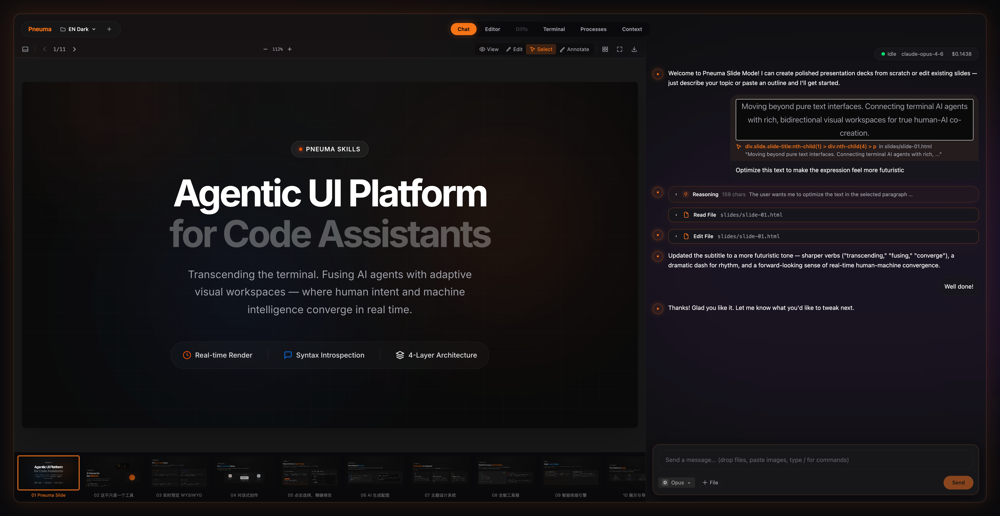

<p align="center">
  
</p>

<h1 align="center">Pneuma Skills</h1>
<p align="center"><strong>Co-creation Infrastructure for Humans × Code Agents</strong></p>
<p align="center">Visual environment, skills, continuous learning, and distribution — <br>everything humans and agents need to build content together.</p>

<p align="center">
  <a href="https://www.npmjs.com/package/pneuma-skills"></a>
  <a href="https://www.npmjs.com/package/pneuma-skills"></a>
  <a href="https://github.com/pandazki/pneuma-skills/releases"></a>
  <a href="LICENSE"></a>
</p>

<p align="center">
  
</p>

<pre align="center">bunx pneuma-skills slide --workspace ./my-first-pneuma-slide</pre>

---

> **"pneuma"** — Greek *pneuma*, meaning soul, breath, life force.

When humans and code agents co-create content, they need more than a chat window — they need shared infrastructure. Pneuma's bet is simple: **coding agents already do the work; what's missing is a way for people to watch them and participate at the right moments**. Agents live in files on disk — that's their native habitat and we don't try to abstract it away. Instead, we give each task a live player that renders the work in domain terms (a deck of slides, a board of tiles, a project) and let humans drop in direct edits or structured suggestions without breaking the agent's flow. Four pillars for **isomorphic collaboration**, built atop mainstream code agents. Today the production path is [Claude Code](https://docs.anthropic.com/en/docs/claude-code); the runtime now exposes a startup-selectable backend layer so additional agents can be integrated without rewriting the UI shell.

| Pillar | What it does |
|--------|-------------|
| **Visual Environment** | Agent works directly in files on disk — its native surface. Viewers are live players for agent output rendered in domain terms, with optional human participation directly in the UI. |
| **Skills** | Domain-specific knowledge and seed templates injected per mode. Sessions persist across runs — the agent picks up where it left off |
| **User Preferences** | The agent builds and maintains a persistent portrait of your aesthetics, collaboration style, and per-mode habits — preferences survive across sessions, workspaces, and modes |
| **Continuous Learning** | Evolution Agent mines conversation history to extract preferences, then augments skills with learned knowledge |
| **Distribution** | Build custom modes with AI via Mode Maker, publish to the marketplace, share with `pneuma mode add` |

## Built-in Modes

| Mode | What it does | Version |
|------|-------------|---------|
| **webcraft** | Live web development with [Impeccable](https://impeccable.style) AI design intelligence — 20 design commands, responsive preview, export | **2.30.0** |
| **kami** | Paper-canvas web design — warm parchment aesthetic, locked paper size (A4/A5/A3/Letter/Legal × portrait/landscape), three worked demo layouts, Print-to-PDF. Design language adapted from [tw93/kami](https://github.com/tw93/kami) | **1.0.0** |
| **slide** | HTML presentations — content sets, drag-reorder, presenter mode, PDF/image export. Skill design guidelines informed by [frontend-slides](https://github.com/zarazhangrui/frontend-slides) | 2.18.0 |
| **doc** | Markdown documents with live preview — the simplest mode, a minimal example of the mode system | 2.18.0 |
| **draw** | Diagrams and visual thinking on an [Excalidraw](https://excalidraw.com) canvas | 2.18.0 |
| **diagram** | Professional [draw.io](https://www.drawio.com) diagrams — flowcharts, architecture, UML, ER, with streaming render and sketch style | **2.27.0** |
| **illustrate** | AI illustration studio — generate and curate visual assets on a row-based canvas with content sets | 2.18.0 |
| **mode-maker** | Create custom modes with AI — fork, play-test, publish | 2.18.0 |
| **evolve** | Evolution Agent — analyze history, propose skill improvements, apply/rollback | 2.25.0 |

## Getting Started

### Desktop App (recommended)

Download the latest release for your platform:

| Platform | Download |
|----------|----------|
| macOS (Apple Silicon) | [`.dmg`](https://github.com/pandazki/pneuma-skills/releases/latest) |
| Windows x64 | [`.exe` installer](https://github.com/pandazki/pneuma-skills/releases/latest) |
| Windows ARM64 | [`.exe` installer](https://github.com/pandazki/pneuma-skills/releases/latest) |
| Linux x64 | [`.AppImage`](https://github.com/pandazki/pneuma-skills/releases/latest) / [`.deb`](https://github.com/pandazki/pneuma-skills/releases/latest) |

The desktop app bundles Bun — no runtime install needed. Install [Claude Code CLI](https://docs.anthropic.com/en/docs/claude-code) and you're ready to go. The launcher shows available backends — currently Claude Code and Codex are implemented.

### CLI

```bash
# Prerequisites: Bun >= 1.3.5, Claude Code CLI and/or Codex CLI

# Open the Launcher (marketplace UI)
bunx pneuma-skills

# Start a mode with a fresh workspace
bunx pneuma-skills slide --workspace ./my-first-pneuma-slide

# Explicit backend selection at startup
bunx pneuma-skills doc --backend claude-code

# Or use the current directory
bunx pneuma-skills doc
```

<details>
<summary><strong>Install from source</strong></summary>

```bash
git clone https://github.com/pandazki/pneuma-skills.git
cd pneuma-skills
bun install
bun run dev doc --workspace ~/my-notes
```

</details>

## CLI Usage

```
pneuma-skills [mode] [options]

Modes:
  (no argument)                Open the Launcher (marketplace UI)
  webcraft                     Web design with Impeccable.style
  slide                        HTML presentations
  doc                          Markdown with live preview
  draw                         Excalidraw canvas
  diagram                      draw.io diagrams
  illustrate                   AI illustration studio
  mode-maker                   Create custom modes with AI
  evolve                       Launch the Evolution Agent
  /path/to/mode                Load from a local directory
  github:user/repo             Load from GitHub
  https://...tar.gz            Load from URL

Options:
  --workspace <path>   Target workspace directory (default: cwd)
  --port <number>      Server port (default: 17996)
  --backend <type>     Agent backend to launch (default: claude-code)
  --no-open            Don't auto-open the browser
  --skip-skill         Skip skill installation
  --debug              Enable debug mode
  --dev                Force dev mode (Vite)

Subcommands:
  evolve <mode>        Analyze history and propose skill improvements
  mode add <url>       Install a remote mode
  mode list            List published modes
  mode publish         Publish current workspace as a mode
  snapshot push/pull   Upload/download workspace snapshot
```

## Architecture

```
┌─────────────────────────────────────────────────────────┐
│  Desktop / Launcher                                     │
│  Browse → Discover → Launch → Resume                    │
├─────────────────────────────────────────────────────────┤
│  Layer 4: Mode Protocol                                 │
│  ModeManifest — skill + viewer config + agent prefs     │
├─────────────────────────────────────────────────────────┤
│  Layer 3: Content Viewer                                │
│  ViewerContract — render, select, agent-callable actions│
├─────────────────────────────────────────────────────────┤
│  Layer 2: Agent Runtime                                 │
│  Backend registry + protocol bridge + normalized state  │
├─────────────────────────────────────────────────────────┤
│  Layer 1: Runtime Shell                                 │
│  HTTP, WebSocket, PTY, File Watch, Frontend             │
└─────────────────────────────────────────────────────────┘
```

Three core contracts in `core/types/`:

| Contract | Responsibility | Extend to... |
|----------|---------------|-------------|
| **ModeManifest** | Skill, viewer config, agent preferences, init seeds | New modes (mindmap, canvas, etc.) |
| **ViewerContract** | Preview component, context extraction, action protocol | Custom renderers, viewport tracking |
| **AgentBackend** | Launch, resume, kill, capability declaration | Other agents (Aider, etc.) |

The backend contract is intentionally split in two layers:

- Process lifecycle: `AgentBackend` owns launch, resume, exit, and capability declaration.
- Session/UI contract: the browser consumes normalized session state (`backend_type`, `agent_capabilities`, `agent_version`) rather than backend-specific wire details.

That means backend-specific protocols stay in `backends/<name>/`, while the UI and most server code depend on a stable session model.

## User Preferences

Pneuma agents remember who you are. Every mode ships with a built-in preference skill that lets the agent build and maintain a persistent portrait of your tastes and habits:

```
~/.pneuma/preferences/
├── profile.md        ← cross-mode: aesthetics, language, collaboration style
├── mode-slide.md     ← slide-specific: layout density, color tendencies, font choices
├── mode-webcraft.md  ← webcraft-specific: design patterns, component preferences
└── ...
```

**How it works:**

- The agent reads your preferences before making design or style decisions — silently, without asking
- When it notices a stable pattern or you state a preference, it updates the files — silently, without announcing
- Hard constraints (e.g. "never use dark backgrounds") are marked as **critical** and auto-injected into every session startup
- A changelog at the end of each file lets the agent do incremental refreshes instead of re-analyzing everything

**Three layers of understanding:**

1. **Observable** — language, aesthetics, collaboration style (a few sessions)
2. **Deep profile** — value anchors, latent patterns, contradictions (many sessions, evidence-required)
3. **Per-mode** — concrete habits in each mode, with explicit user-stated vs. agent-observed distinction

The preference files are living documents — full rewrites, not append-only logs. Contradictions are preserved, not resolved. Everything is deletable. The agent builds understanding over time, not a label database.

**Quick start tip:** If you already have a history of working with Claude Code, try asking the agent in any mode: *"Do a full preference refresh from my session history."* The agent will scan your past Pneuma sessions, extract your patterns and preferences, and build your profile in one pass — you might be surprised by what it picks up. This works with both Claude Code and Codex backends.

## Tech Stack

| Layer | Technology |
|-------|-----------|
| Runtime | [Bun](https://bun.sh) >= 1.3.5 |
| Server | [Hono](https://hono.dev) 4.7 |
| Frontend | React 19 + [Vite](https://vite.dev) 7 + [Tailwind CSS](https://tailwindcss.com) 4 + [Zustand](https://zustand.docs.pmnd.rs) 5 |
| Desktop | [Electron](https://www.electronjs.org) 41 + electron-builder + electron-updater |
| Terminal | [xterm.js](https://xtermjs.org) 6 + Bun native PTY |
| Drawing | [Excalidraw](https://excalidraw.com) 0.18 |
| Diagramming | [draw.io](https://www.drawio.com) viewer-static (CDN) + [rough.js](https://roughjs.com) 4.6 |
| Video | [Remotion](https://www.remotion.dev) 4.0 + @remotion/player + @babel/standalone |
| Canvas | [@xyflow/react](https://reactflow.dev) 12 (Illustrate mode) |
| File Watching | [chokidar](https://github.com/paulmillr/chokidar) 5 |
| Agent | Claude Code CLI via `--sdk-url`; Codex CLI via app-server stdio JSON-RPC |

## Backend Model

- Backend is selected once at launch with `--backend` or in the launcher modal.
- The selected backend is persisted in `<workspace>/.pneuma/session.json` and `~/.pneuma/sessions.json`.
- Existing workspaces are backend-locked. Pneuma resumes the same backend for the lifetime of that workspace session instead of switching mid-stream.
- Frontend features now read `agent_capabilities` from session state. Claude-only features such as Schedules and cost tracking are hidden for non-Claude backends.

## Acknowledgements

This project's Claude transport layer, NDJSON handling, and much of the initial chat bridge were heavily informed by [Companion](https://github.com/The-Vibe-Company/companion) by The Vibe Company.

Companion remains the reference for Claude Code's undocumented `--sdk-url` transport. Pneuma's newer backend layer keeps that Claude-specific protocol inside `backends/claude-code/` so future backends can plug in through their own adapters instead of inheriting Claude wire assumptions everywhere.

The **kami mode**'s entire visual language — warm parchment canvas, ink-blue accent, serif-led hierarchy, font selection, and the three worked demo templates seeded into new kami workspaces — is adapted from [tw93/kami](https://github.com/tw93/kami) (MIT), an open-source typesetting design system. Our layer adds the locked-paper-size viewer and Pneuma runtime wiring; the craft belongs to Tw93. Full attribution, font licenses (OFL 1.1 + TsangerJinKai02 personal-use), and per-demo provenance live in `modes/kami/NOTICE.md`.

## License

[MIT](LICENSE)
