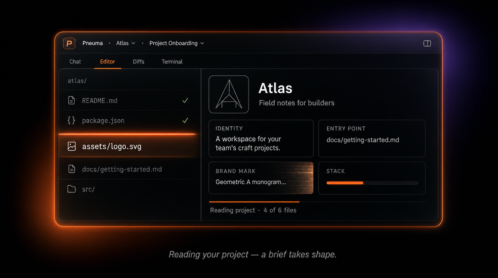
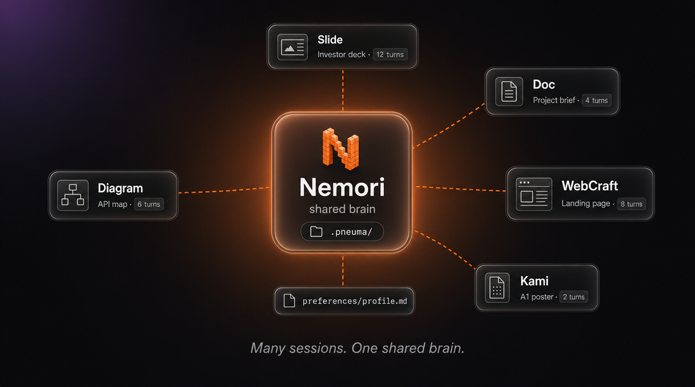

<p align="center">
  
</p>

<h1 align="center">Pneuma Skills</h1>
<p align="center"><strong>面向人类与代码 Agent 的协同创作基础设施</strong></p>
<p align="center">视觉环境、技能体系、持续学习、分发能力 —— <br>把人和 agent 协作时所需的所有东西，做成一层共享底座。</p>

<p align="center">
  <a href="https://www.npmjs.com/package/pneuma-skills"></a>
  <a href="https://www.npmjs.com/package/pneuma-skills"></a>
  <a href="https://github.com/pandazki/pneuma-skills/releases"></a>
  <a href="LICENSE"></a>
</p>

<p align="center">
  <a href="README.md">English</a> · <a href="#内置-modes">Modes</a> · <a href="#上手">上手</a> · <a href="#projects-30">Projects</a>
</p>

<p align="center">
  
</p>

<pre align="center">bunx pneuma-skills slide --workspace ./my-first-pneuma-slide</pre>

---

> **"pneuma"** —— 希腊语，意为灵魂、呼吸、生命之气。

人和代码 agent 一起做内容这件事，光有一个聊天窗远远不够 —— 双方需要一层共享的基础设施。Pneuma 的判断很简单：**真正干活的工具其实早就有了（agent 已经能在你的目录里动文件），缺的是一种让人能够看到 agent 在做什么、并且在合适的时机参与进来的方式**。Agent 的母语就是磁盘上的文件，我们不试图在它和文件之间塞一层抽象。我们做的是给每一类任务配一个"现场播放器"（live player），让 agent 的产出按它本来的样子被渲染出来 —— 一份幻灯片、一块仪表盘、一个项目 —— 让你既能看着它工作，也能直接在 UI 里改、或者用结构化的指令推它一把。这是 Pneuma 的四根柱子，搭在主流的 code agent 之上。今天的主路是 [Claude Code](https://docs.anthropic.com/en/docs/claude-code)；运行时支持启动期选择后端，新 agent 可以接进来而不用重写整个 UI 壳。

| 支柱 | 它做什么 |
|------|------|
| **视觉环境** | Agent 直接在磁盘上的文件里干活 —— 那是它的本土。Viewer 是它产出的现场播放器，按领域语言渲染，必要时人可以直接在 UI 里改 |
| **技能** | 每个 mode 注入对应领域的知识 + 种子模板。会话跨次持久化 —— agent 接着上次的进度继续 |
| **用户偏好** | Agent 持续维护一份关于你的画像（审美、合作方式、各 mode 的具体习惯），跨会话、跨工作区、跨 mode 留存 |
| **持续学习** | Evolution Agent 挖掘你过去的会话，提取偏好，再把这些"学到的"东西写回 skill |
| **分发** | Mode Maker 让你和 AI 一起做新 mode，发布到市场，用 `pneuma mode add` 一键安装别人的 |

## 内置 Modes

| Mode | 它做什么 | 版本 |
|------|------|------|
| **webcraft** | 实时网页开发，搭载 [Impeccable](https://impeccable.style) 的 AI 设计能力 —— 22 条设计指令、品牌/产品双声调、响应式预览、导出 | **2.37.0** |
| **clipcraft** | 基于 [@pneuma-craft](https://github.com/pandazki/pneuma-craft) 的 AIGC 视频流水线 —— 资产、Track/Clip 组合、来源 DAG、Scene 划分；Canvas 预览 + 3D 时间线 + 单 clip 钻入面板；图像/视频/TTS/BGM 生成脚本一应俱全 | **2.38.0** |
| **kami** | 纸张画布排版 —— 锁纸张尺寸（A4/A5/A3/Letter/Legal × 横/竖）、Scroll/Focus/Book 三种视图、留白纪律反馈、PDF/PNG/HTML 导出。设计语言改编自 [tw93/kami](https://github.com/tw93/kami) | 2.31.0 |
| **slide** | HTML 幻灯片 —— 多内容集、拖拽排序、演讲者模式、PDF/图片导出。Skill 设计参考了 [frontend-slides](https://github.com/zarazhangrui/frontend-slides) | 2.18.0 |
| **doc** | 带实时预览的 Markdown —— 最简洁的 mode，也是 mode 系统的最小示例 | 2.29.0 |
| **draw** | 在 [Excalidraw](https://excalidraw.com) 画布上做图与可视化思考 | 2.29.0 |
| **diagram** | 专业级 [draw.io](https://www.drawio.com) 图 —— 流程图、架构、UML、ER，支持流式渲染与手绘风格 | **2.27.0** |
| **illustrate** | AI 插画工坊 —— 在分行的画布上生成、整理视觉素材，配合内容集 | 2.29.0 |
| **remotion** | 基于 [Remotion](https://www.remotion.dev) 的代码驱动视频合成 —— 实时预览、逐帧精准动画、WebCodecs 路线导出 MP4/WebM | 2.29.0 |
| **gridboard** | 交互式仪表盘 —— 固定画布上的可拖拽磁贴网格，通过 `defineTile()` 协议定义 React 磁贴，浏览器端 JIT 编译 | 2.29.0 |
| **mode-maker** | 用 AI 做自定义 mode —— fork、Play 试跑、发布 | 2.35.0 |
| **evolve** | Evolution Agent —— 分析历史、提出技能改进、apply / 回滚 | 2.25.0 |

## 第一次进项目时，Pneuma 会带着你走一遍

新建项目，Pneuma 会主动迎接你。一个隐藏的 `project-onboard` mode 会在你第一次进入空项目时自动启动 —— 它读你的 README、包清单、视觉资产，然后给你一份"发现报告"：项目是什么、里面有什么、下一步可以做的两件具体事情，每一件都能一键开始。

<p align="center">
  
</p>

agent 干活的 30–60 秒里，loading 槽位会变成一段 10 帧的 carousel，把 Pneuma 的核心讲给你听 —— agent 在真实文件里做事、十二个 mode 同壳、多个会话共享同一个项目大脑。等报告渲染完，你脑子里已经有了地图。

如果你的项目几乎是空的（只有一个 `test.txt` 或一个 stub README），agent 会顺手画一张**见面礼**插画 —— 暮色里的天灯、笔记本上正被画出的星座 —— 再写一句符合你语气的问候。如果项目有内容但没有 logo，它会主动生成一张极简单 monogram 封面，免得 launcher 的项目卡老是显示点状字母占位符。这两件事都需要图像生成 API key 才会触发，没有的话报告照样出，只是少了那点小礼物。

想自己来？Create Project 对话框右侧有个 chevron，里面藏着 **"Create without discovery"** —— 你可以晚些再用 ProjectPanel 上的 **Re-discover** 触发同样的发现流程。

## 上手

### 桌面应用（推荐）

按平台下载最新 release：

| 平台 | 下载 |
|------|------|
| macOS（Apple Silicon） | [`.dmg`](https://github.com/pandazki/pneuma-skills/releases/latest) |
| Windows x64 | [`.exe`](https://github.com/pandazki/pneuma-skills/releases/latest) |
| Windows ARM64 | [`.exe`](https://github.com/pandazki/pneuma-skills/releases/latest) |
| Linux x64 | [`.AppImage`](https://github.com/pandazki/pneuma-skills/releases/latest) / [`.deb`](https://github.com/pandazki/pneuma-skills/releases/latest) |

桌面应用自带 Bun，无需另装 runtime。装好 [Claude Code CLI](https://docs.anthropic.com/en/docs/claude-code) 即可使用。Launcher 里会列出可用后端，目前 Claude Code 与 Codex 都已实现。

### 命令行

```bash
# 前置：Bun >= 1.3.5、Claude Code CLI 和/或 Codex CLI

# 打开 Launcher（市场化 UI）
bunx pneuma-skills

# 用一个全新工作区起一个 mode
bunx pneuma-skills slide --workspace ./my-first-pneuma-slide

# 启动期显式选后端
bunx pneuma-skills doc --backend claude-code

# 也可以直接用当前目录
bunx pneuma-skills doc
```

<details>
<summary><strong>从源码安装</strong></summary>

```bash
git clone https://github.com/pandazki/pneuma-skills.git
cd pneuma-skills
bun install
bun run dev doc --workspace ~/my-notes
```

</details>

## CLI 用法

```
pneuma-skills [mode] [options]

Modes:
  (无参数)                     打开 Launcher（市场化 UI）
  webcraft                     基于 Impeccable.style 的网页设计
  clipcraft                    AIGC 视频流水线
  kami                         纸张画布排版
  slide                        HTML 幻灯片
  doc                          带实时预览的 Markdown
  draw                         Excalidraw 画布
  diagram                      draw.io 图
  illustrate                   AI 插画工坊
  remotion                     代码驱动的视频合成
  gridboard                    交互式磁贴仪表盘
  mode-maker                   用 AI 做自定义 mode
  evolve                       启动 Evolution Agent
  /path/to/mode                从本地目录加载
  github:user/repo             从 GitHub 加载
  https://...tar.gz            从 URL 加载

Options:
  --workspace <path>   工作区目录（默认：cwd）
  --port <number>      服务端口（默认：17996）
  --backend <type>     启动期选后端（claude-code | codex）
  --project <path>     作为该项目的会话运行
  --session-id <id>    按 id 恢复一个项目内会话（与 --project 配合）
  --session-name <s>   自定义会话显示名
  --viewing            观看模式（不启动 agent，不装 skill）
  --no-open            不自动打开浏览器
  --skip-skill         跳过 skill 安装（静默 resume）
  --debug              调试模式
  --dev                强制 dev 模式（Vite）

Subcommands:
  mode add <url>           安装远端 mode 到 ~/.pneuma/modes/
  mode list                列出 R2 上已发布的 mode
  mode publish             把当前工作区作为 mode 发布
  evolve <mode>            分析历史、提出 skill 改进
  plugin add <source>      安装插件（路径 / GitHub / URL）
  plugin list              列出内置 + 外部插件
  plugin remove <name>     卸载外部插件
  history export [--out]   把当前会话导出为可分享的 .tar.gz
  history share [--title]  导出 + 上传 R2，返回链接
  history open <path|url>  下载 / 准备一个 replay 包
  sessions rebuild         从磁盘恢复 "Continue" 列表
  snapshot push / pull     上传 / 下载工作区快照
```

## 架构

```
┌─────────────────────────────────────────────────────────┐
│  Desktop / Launcher                                     │
│  浏览 → 发现 → 启动 → 恢复                              │
├─────────────────────────────────────────────────────────┤
│  Layer 4: Mode Protocol                                 │
│  ModeManifest —— skill + viewer 配置 + agent 偏好       │
├─────────────────────────────────────────────────────────┤
│  Layer 3: Content Viewer                                │
│  ViewerContract —— 渲染、选区、agent 可调用的 actions   │
├─────────────────────────────────────────────────────────┤
│  Layer 2: Agent Runtime                                 │
│  后端注册表 + 协议桥 + 标准化 session state             │
├─────────────────────────────────────────────────────────┤
│  Layer 1: Runtime Shell                                 │
│  HTTP / WebSocket / PTY / 文件监听 / 前端                │
└─────────────────────────────────────────────────────────┘
```

`core/types/` 里有三个核心契约：

| 契约 | 它的责任 | 拿来扩展... |
|------|------|------|
| **ModeManifest** | Skill、viewer 配置、agent 偏好、初始化种子 | 新 mode（mindmap、canvas 等） |
| **ViewerContract** | Preview 组件、上下文抽取、action 协议 | 自定义渲染器、视口跟踪 |
| **AgentBackend** | 启动、恢复、终止、能力声明 | 接其它 agent（Aider 之类） |

后端契约故意做了双层：

- **进程生命周期**：`AgentBackend` 负责启动、恢复、退出、能力声明
- **会话/UI 契约**：浏览器消费的是标准化的 session 状态（`backend_type` / `agent_capabilities` / `agent_version`），不直接看后端的协议细节

也就是说，后端特有的协议留在 `backends/<name>/`，UI 和大部分 server 代码只依赖一个稳定的 session 模型。

## 用户偏好

Pneuma 的 agent 记得你是谁。每个 mode 都自带一份偏好 skill，让 agent 持续维护一份关于你的画像：

```
~/.pneuma/preferences/
├── profile.md        ← 跨 mode：审美、语言、合作方式
├── mode-slide.md     ← slide 专属：版面密度、配色倾向、字体偏好
├── mode-webcraft.md  ← webcraft 专属：设计模式、组件偏好
└── ...
```

**怎么运作：**

- 在做设计或风格决定之前，agent 会先读你的偏好 —— 安静地，不问你
- 当它注意到一个稳定模式、或者你明确表态时，它会更新这些文件 —— 安静地，不通知你
- 硬约束（比如"绝对不要深色背景"）会被标成 **critical**，每次会话启动时自动注入到 prompt 里
- 文件末尾的 changelog 让 agent 可以做增量刷新，而不是每次重新分析全部历史

**三层理解：**

1. **可观察的** —— 语言、审美、合作方式（几次会话就能看出来）
2. **深层画像** —— 价值锚点、潜在模式、矛盾点（多次会话，需要证据）
3. **每个 mode 的** —— 在这个 mode 里的具体习惯，明确区分"用户陈述"和"agent 观察"

偏好文件是活文档 —— 整体重写，不是 append-only 日志。矛盾会被保留，不会被强行调和。所有内容都可删除。Agent 是在时间维度上慢慢搭建理解，不是在堆标签数据库。

**冷启动小窍门：** 如果你已经用 Claude Code 干过不少活，可以在任何 mode 里跟 agent 说："*把我所有的会话历史扫一遍，做一次完整的偏好刷新。*" agent 会扫过你过去的 Pneuma 会话，把模式和偏好抽出来，一次性给你画好画像 —— 你可能会被它注意到的东西惊到。Claude Code 和 Codex 后端都支持。

## Projects (3.0)

Pneuma 支持在 session 之上的可选 Project 层 —— 用来锚定**一件正在进行的事**，让多个 mode 的多次会话围绕它展开，共享偏好和项目简报。

<p align="center">
  
</p>

任何带 `<root>/.pneuma/project.json` 标记的目录就是一个项目。在项目内你可以：

- **在不同 mode 里跑多个 session**（doc + webcraft + kami + …），都指向同一个项目根，共享同一份 atlas 和 preferences
- **跨 mode 的 Smart Handoff** —— 源 agent 发出结构化的 `<pneuma:request-handoff>` 标签，Pneuma 弹出 Handoff 卡片（intent + 建议文件 + 关键决定），你确认，目标 session 启动时这份 brief 已经写进了它的 CLAUDE.md
- **项目级偏好**位于 `<root>/.pneuma/preferences/`，与全局 `~/.pneuma/preferences/` 正交 —— 两套都会注入到每个会话的启动 prompt
- **首次进入自动 onboarding**（见上方"[第一次进项目时](#第一次进项目时pneuma-会带着你走一遍)"）

不开项目（也就是 quick session）依然完整支持 —— project 层是**可选**的。从 launcher 的 "+ Create Project" 按钮新建。完整设计见 [`docs/archive/proposals/2026-04-27-pneuma-projects-design.md`](docs/archive/proposals/2026-04-27-pneuma-projects-design.md)（3.0 项目层）和 [`2026-04-28-handoff-tool-call.md`](docs/archive/proposals/2026-04-28-handoff-tool-call.md)（handoff 协议）。

## 技术栈

| 层 | 技术 |
|------|------|
| Runtime | [Bun](https://bun.sh) >= 1.3.5 |
| Server | [Hono](https://hono.dev) 4.7 |
| Frontend | React 19 + [Vite](https://vite.dev) 7 + [Tailwind CSS](https://tailwindcss.com) 4 + [Zustand](https://zustand.docs.pmnd.rs) 5 |
| Desktop | [Electron](https://www.electronjs.org) 41 + electron-builder + electron-updater |
| Terminal | [xterm.js](https://xtermjs.org) 6 + Bun 原生 PTY |
| 画布 | [Excalidraw](https://excalidraw.com) 0.18 |
| 图表 | [draw.io](https://www.drawio.com) viewer-static (CDN) + [rough.js](https://roughjs.com) 4.6 |
| 视频 | [Remotion](https://www.remotion.dev) 4.0 + @remotion/player + @babel/standalone |
| 节点画布 | [@xyflow/react](https://reactflow.dev) 12（Illustrate mode） |
| 文件监听 | [chokidar](https://github.com/paulmillr/chokidar) 5 |
| Agent | Claude Code CLI 走 stdio stream-json（`-p --input-format/--output-format stream-json`）；Codex CLI 走 app-server stdio JSON-RPC |

## 后端模型

- 后端在启动时通过 `--backend` 或 launcher 弹窗一次性选定。
- 所选后端持久化到 `<workspace>/.pneuma/session.json` 与 `~/.pneuma/sessions.json`。
- 已有的工作区**锁定**到当时选的后端 —— Pneuma 会用同一个后端 resume，不允许中途切换。
- 前端按 session state 里的 `agent_capabilities` 做能力门控。Schedules、cost tracking 这类 Claude 独有的能力对其它后端会自动隐藏。

## License

[MIT](LICENSE)
