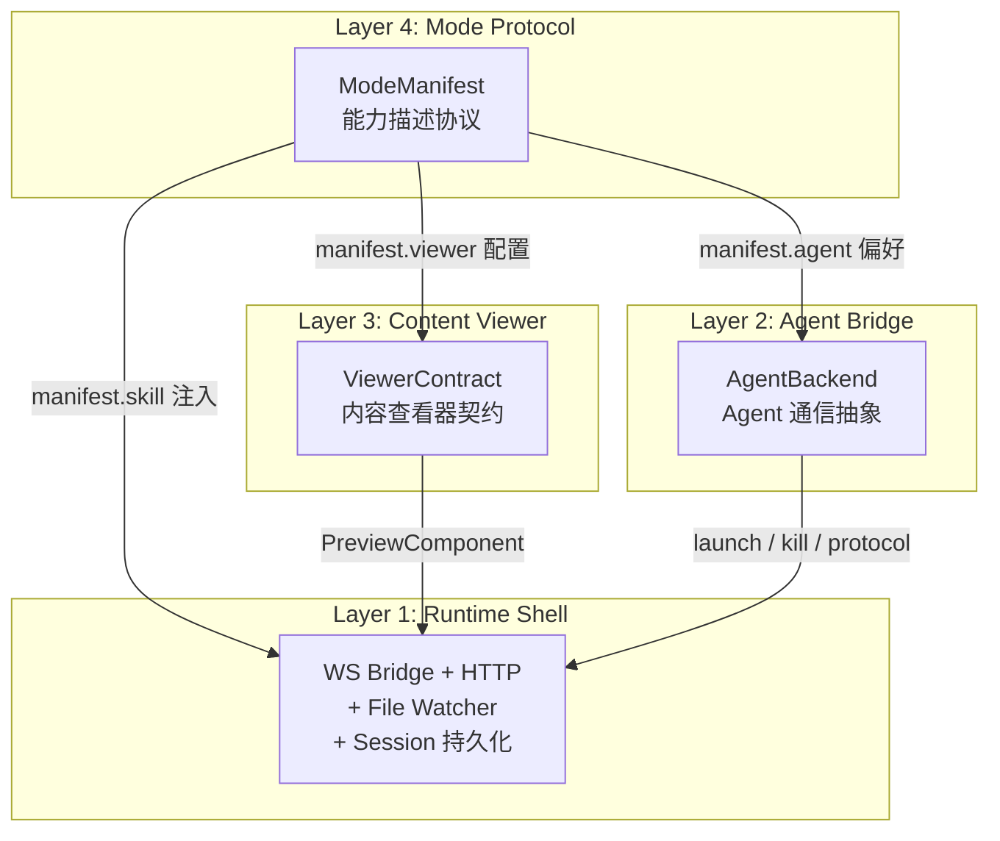
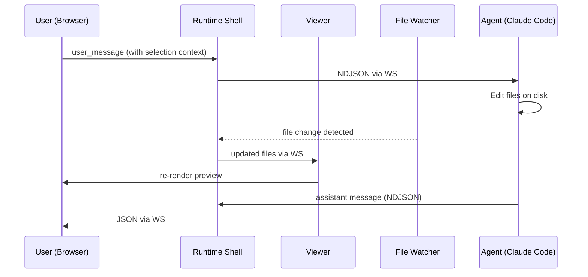
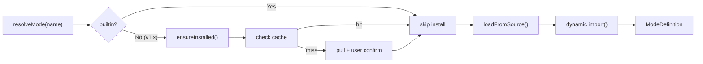
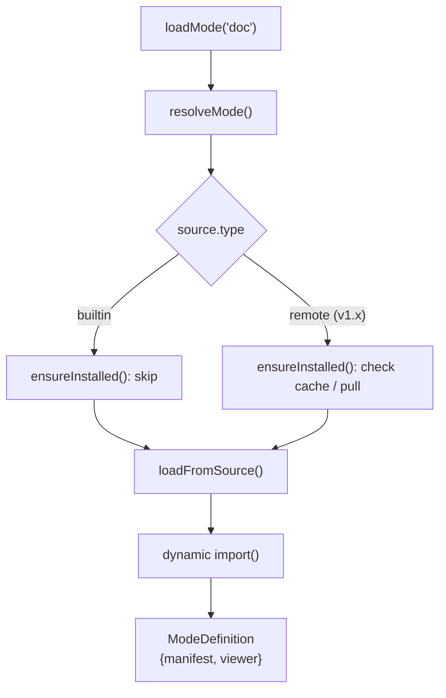
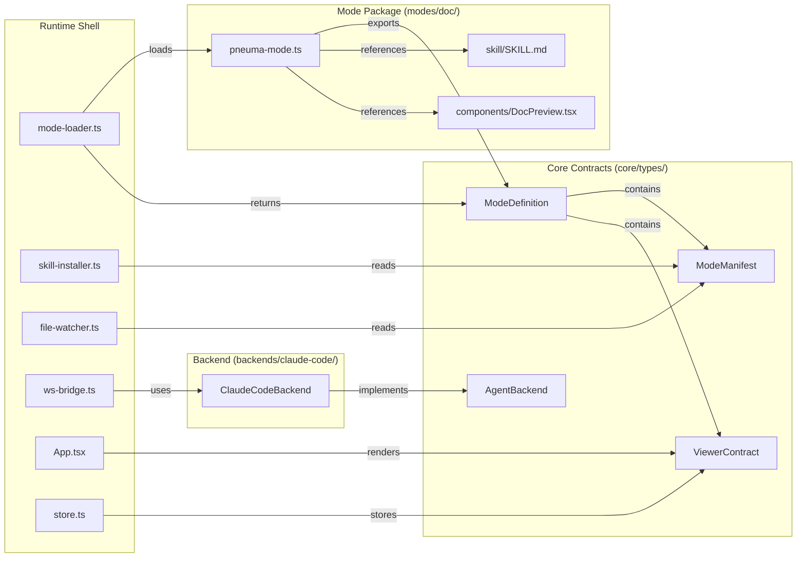

# v1.0: 全面解耦 — 详细设计文档

> **目标**: 在不改变任何外部行为的前提下，将所有硬编码切开为契约驱动。三层契约全部定义 + 各有至少一个实现 + 消费侧完全通过接口驱动。
> **验证标准**: `pneuma doc` 的行为与 v0.5.0 完全一致，但内部已通过 manifest + 接口驱动。
> **参考**: `docs/architecture-review-v1.md`

---

## 1. 设计范围

### 1.1 做什么

将当前硬编码提取为三层契约，每层都有接口定义和至少一个实现：

| 契约 | 职责 | 当前硬编码位置 | 实现 |
|------|------|---------------|------|
| **ModeManifest** | 描述一个 Mode 的完整配置 | `pneuma.ts` + `skill-installer.ts` | `modes/doc/` |
| **ViewerContract** | 描述内容查看器的 UI 能力 | `App.tsx` + `MarkdownPreview.tsx` | `modes/doc/DocPreview` |
| **AgentBackend** | 描述 Agent 的启动/通信/生命周期 | `cli-launcher.ts` + `ws-bridge.ts` | `backends/claude-code/` |

### 1.2 不做什么

- **不做** 远程 Mode 加载 — v1.x
- **不做** Slide Mode 实现 — v1.1 (新功能，非架构)
- **不做** 第二个 Agent 适配层 — 等真正需要时
- **不做** 多 Mode 运行时切换 — 启动时确定，运行期间不变

---

## 2. 架构概览

### 2.1 四层抽象模型



### 2.2 核心数据流



### 2.3 Mode 加载流程



### 2.4 工作区布局


左侧 **Viewer Panel** 由 Mode 提供（如 DocPreview / SlidePreview / CanvasViewer），底部有 view/edit/select 模式切换；右侧 **Runtime Shell** 是通用基座，顶部 Tab 切换 Chat / Context / Terminal，底部状态栏显示会话信息。

---

## 3. 契约定义

### 3.1 ModeManifest — 能力描述协议

Mode 的声明式描述，由 Mode 包提供。

```typescript
// core/types/mode-manifest.ts

export interface ModeManifest {
  name: string;
  version: string;
  displayName: string;
  description: string;

  skill: SkillConfig;
  viewer: ViewerConfig;       // 内容查看器配置
  agent?: AgentPreferences;
  init?: InitConfig;
}

export interface SkillConfig {
  sourceDir: string;           // 相对于 mode 包根目录
  installName: string;         // ".claude/skills/pneuma-{name}"
  claudeMdSection: string;     // 注入 CLAUDE.md 的内容
}

export interface ViewerConfig {
  watchPatterns: string[];     // ["**/*.md", "**/*.html"]
  ignorePatterns: string[];    // ["node_modules/**", ".git/**"]
  serveDir?: string;           // 需要 HTTP 服务的目录
}

export interface AgentPreferences {
  permissionMode?: string;
  greeting?: string;
}

export interface InitConfig {
  seedFiles?: Record<string, string>;
  contentCheckPattern?: string;
}
```

### 3.2 ViewerContract — 内容查看器契约

查看器的 UI 能力声明，由前端组件实现。

```typescript
// core/types/viewer-contract.ts

import type { ComponentType } from "react";

export interface ViewerContract {
  PreviewComponent: ComponentType<ViewerPreviewProps>;
  extractContext(
    selection: ViewerSelectionContext | null,
    files: ViewerFileContent[],
  ): string;
  updateStrategy: "full-reload" | "incremental";
}

export interface ViewerPreviewProps {
  files: ViewerFileContent[];
  selection: ViewerSelectionContext | null;
  onSelect: (selection: ViewerSelectionContext | null) => void;
  mode: "view" | "edit" | "select";
  contentVersion: number;
  imageVersion: number;
}
```

### 3.3 ModeDefinition — 运行时 Mode 对象

将 Manifest (声明式) 和 Viewer (组件级) 绑定在一起。

```typescript
// core/types/mode-definition.ts

export interface ModeDefinition {
  manifest: ModeManifest;
  viewer: ViewerContract;       // 内容查看器实现
}
```

### 3.4 AgentBackend — Agent 通信抽象

以 Claude Code 协议为事实标准设计。详见 `core/types/agent-backend.ts`。

**核心接口**：
- `AgentBackend` — 生命周期管理 (launch/resume/kill/markConnected)
- `AgentCapabilities` — 能力声明 (streaming/resume/permissions/toolProgress/modelSwitch)
- `AgentProtocolAdapter` — 消息协议适配 (parseIncoming/encodeOutgoing)

**ClaudeCodeBackend 的提取**：
- 从 `server/cli-launcher.ts` 的 `CliLauncher` 类提取
- 实现 `AgentBackend` 接口
- `CliLauncher.SdkSessionInfo` → `AgentSessionInfo` (字段对齐)
- `CliLauncher.LaunchOptions` → `AgentLaunchOptions` (字段对齐)
- 放置于 `backends/claude-code/` 目录

**Protocol Adapter 策略**：
- v1.0 中**不**在 ws-bridge 和 Agent 之间插入中间层
- ws-bridge 继续直接使用 `session-types.ts` 中的 CLI 消息类型
- AgentProtocolAdapter 接口作为设计约束存在，但 Claude Code 的 adapter 是直通的 (NDJSON parse/stringify)
- 当第二个 Agent 出现时，再决定是否需要 StandardMessage 中间格式

---

## 4. Doc Mode 的 Manifest 化

### 4.1 目录结构变更

```
之前:
  skill/doc/SKILL.md                    ← 硬编码路径
  server/skill-installer.ts             ← 硬编码内容

之后:
  modes/doc/
  ├── pneuma-mode.ts                    ← ModeDefinition (manifest + viewer)
  ├── skill/
  │   └── SKILL.md                      ← 不变
  └── components/
      └── DocPreview.tsx                ← 从 src/components/MarkdownPreview.tsx 移动
```

### 4.2 modes/doc/pneuma-mode.ts

```typescript
import type { ModeDefinition } from "../../core/types/mode-definition.js";
import { DocPreview } from "./components/DocPreview.js";

const docMode: ModeDefinition = {
  manifest: {
    name: "doc",
    version: "0.5.0",
    displayName: "Document",
    description: "Markdown document editing with live preview",

    skill: {
      sourceDir: "skill",           // 相对于 modes/doc/
      installName: "pneuma-doc",    // → .claude/skills/pneuma-doc/
      claudeMdSection: `## Pneuma Doc Mode

You are running inside Pneuma Doc Mode. A user is viewing your markdown edits live in a browser.

**Important**: When the user asks you to make changes, edit the markdown files directly using the Edit or Write tools. The user sees updates in real-time.

- Workspace contains markdown (.md) files
- Make focused, incremental edits
- Use GitHub-Flavored Markdown (GFM)
- Do not ask for confirmation on simple edits — just do them`,
    },

    viewer: {
      watchPatterns: ["**/*.md"],
      ignorePatterns: [
        "node_modules/**",
        ".git/**",
        ".claude/**",
        ".pneuma/**",
        "CLAUDE.md",
      ],
      serveDir: ".",
    },

    agent: {
      permissionMode: "bypassPermissions",
      greeting: "The user just opened the Pneuma document editor workspace. Briefly greet them and let them know you're ready to help edit and create documents. Keep it to 1-2 sentences.",
    },

    init: {
      contentCheckPattern: "**/*.md",
      seedFiles: {
        "README.md": "README.md",   // 从项目根目录复制
      },
    },
  },

  viewer: {
    PreviewComponent: DocPreview,
    extractContext: (selection, files) => {
      const parts: string[] = [];
      if (files.length > 0) {
        const viewingFile = files[0];
        if (viewingFile) {
          parts.push(`[User is viewing: ${viewingFile.path}]`);
        }
      }
      if (selection) {
        const desc = selection.level
          ? `${selection.type} (level ${selection.level})`
          : selection.type;
        parts.push(`[User selected: ${desc} "${selection.content}"]`);
      }
      return parts.join("\n");
    },
    updateStrategy: "full-reload",
  },
};

export default docMode;
```

---

## 5. 消费侧变更

### 5.1 Mode Loader (core/mode-loader.ts)

**关键设计约束**：所有 Mode 组件必须通过动态 import 加载，不允许静态 import。
这确保 App.tsx 完全不知道具体有哪些 mode，为远程 mode 加载铺路。

```typescript
// core/mode-loader.ts

import type { ModeDefinition } from "./types/mode-definition.js";

type ModeSource =
  | { type: "builtin"; loader: () => Promise<ModeDefinition> }

const builtinModes: Record<string, ModeSource> = {
  doc: { type: "builtin", loader: () => import("../modes/doc/pneuma-mode.js").then(m => m.default) },
};

export async function loadMode(name: string): Promise<ModeDefinition> {
  const source = resolveMode(name);
  await ensureInstalled(source);
  return loadFromSource(source);
}

function resolveMode(name: string): ModeSource { ... }
async function ensureInstalled(source: ModeSource): Promise<void> { ... }
async function loadFromSource(source: ModeSource): Promise<ModeDefinition> { ... }
```

**核心流程: `resolveMode → ensureInstalled → loadFromSource`**



### 5.2 skill-installer.ts 重构

从硬编码改为接收 `SkillConfig` 参数：

```typescript
// 之前:
export function installSkill(workspace: string): void { ... }

// 之后:
export function installSkill(
  workspace: string,
  skillConfig: SkillConfig,
  modeSourceDir: string,   // mode 包的绝对路径
): void { ... }
```

### 5.3 file-watcher.ts 重构

从硬编码 `.md` 过滤改为接收 `ViewerConfig` 参数：

```typescript
// 之前:
export function startFileWatcher(
  workspace: string,
  onUpdate: (files: FileContent[]) => void,
): void { ... }

// 之后:
export function startFileWatcher(
  workspace: string,
  viewerConfig: ViewerConfig,
  onUpdate: (files: FileContent[]) => void,
): void { ... }
```

内部使用 `viewerConfig.watchPatterns` 和 `viewerConfig.ignorePatterns`。

### 5.4 bin/pneuma.ts 重构

编排层从「知道 doc mode 的一切」变为「通过 ModeDefinition 驱动一切」：

```typescript
// 之前:
if (!mode || mode !== "doc") { ... }
installSkill(workspace);

// 之后:
const modeDef = await loadMode(mode);
installSkill(workspace, modeDef.manifest.skill, modeSourceDir);
// greeting, permissionMode, etc. all from modeDef.manifest
```

### 5.5 App.tsx 左面板 — 动态组件加载

**关键**：App.tsx 不能静态 import 任何 Mode 组件。PreviewComponent 通过 store 动态获取。

```tsx
// ❌ 禁止：
import MarkdownPreview from "./components/MarkdownPreview.js";

// ✅ App.tsx 中：
const PreviewComponent = useStore(s => s.modeViewer?.PreviewComponent);
if (!PreviewComponent) return <LoadingScreen />;
return <PreviewComponent files={files} selection={selection} ... />;
```

**加载时机**：
1. `bin/pneuma.ts` 调用 `loadMode("doc")` (动态 import)
2. 得到 `ModeDefinition` 后将 `viewer` 传给前端
3. 前端通过 WS init 消息或初始 API 获取 mode 信息
4. Store 设置 `modeViewer`，App.tsx 响应式渲染

由于 v1.0 只有内置 mode，前端也可以在启动时主动 `loadMode()`。
但加载路径必须经过 mode-loader 的动态 import，不能直接 import 组件文件。

---

## 6. Store 变更

### 6.1 新增字段

```typescript
// store.ts 新增:
modeViewer: ViewerContract | null;
setModeViewer: (viewer: ViewerContract) => void;
```

### 6.2 extractContext 迁移

当前 `ws.ts:sendUserMessage()` 中硬编码了上下文提取逻辑：

```typescript
// 之前 (ws.ts):
if (selection) {
  parts.push(`[User selected: ${selection.type} "${selection.content}"]`);
}

// 之后:
const viewer = useStore.getState().modeViewer;
if (viewer) {
  const context = viewer.extractContext(selection, files);
  if (context) parts.push(context);
}
```

---

## 7. 三层契约关系总览



---

## 8. 文件变更清单

### 8.1 新建文件

| 文件 | 说明 |
|------|------|
| `core/types/mode-manifest.ts` | ModeManifest 契约 |
| `core/types/viewer-contract.ts` | ViewerContract 契约 |
| `core/types/mode-definition.ts` | ModeDefinition 绑定 |
| `core/types/agent-backend.ts` | AgentBackend 契约 |
| `core/types/index.ts` | 类型统一导出 |
| `core/mode-loader.ts` | Mode 加载器 (resolve → ensureInstalled → load) |
| `modes/doc/pneuma-mode.ts` | Doc Mode 定义 (manifest + viewer) |
| `backends/claude-code/index.ts` | ClaudeCodeBackend 实现 AgentBackend |

### 8.2 移动文件

| 原位置 | 新位置 |
|--------|--------|
| `skill/doc/SKILL.md` | `modes/doc/skill/SKILL.md` |
| `src/components/MarkdownPreview.tsx` | `modes/doc/components/DocPreview.tsx` |
| `server/cli-launcher.ts` | `backends/claude-code/cli-launcher.ts` |

### 8.3 重构文件 (原地)

| 文件 | 变更 |
|------|------|
| `server/skill-installer.ts` | 接收 SkillConfig 参数，不再硬编码 |
| `server/file-watcher.ts` | 接收 ViewerConfig 参数，不再硬编码 |
| `bin/pneuma.ts` | 通过 mode-loader + AgentBackend 驱动 |
| `src/App.tsx` | PreviewComponent 从 store 动态获取，不再静态 import |
| `src/ws.ts` | extractContext 委托给 ViewerContract |
| `src/store.ts` | 新增 modeViewer |

---

## 9. 验证计划

### 9.1 契约测试 (新增)

```
core/__tests__/
├── mode-manifest.test.ts      — ModeManifest 类型校验 (必填字段、默认值)
├── viewer-contract.test.ts    — ViewerContract 行为约束
├── mode-loader.test.ts        — 加载内置 mode、未知 mode 报错
├── agent-backend.test.ts      — AgentBackend 生命周期、能力声明
└── doc-mode.test.ts           — doc mode manifest 符合契约、extractContext 正确
```

### 9.2 回归测试

- `pneuma doc` 启动行为不变
- Skill 正确安装到 `.claude/skills/pneuma-doc/`
- CLAUDE.md 注入内容不变
- 文件监听仍然只监听 `.md` 文件
- 预览渲染不变
- 选中上下文注入不变

### 9.3 构建验证

- `bun run build` 成功
- `vite build` 产物包含 modes/doc 的组件
- 类型检查 (`tsc --noEmit`) 通过

---

## 10. 风险与缓解

| 风险 | 影响 | 缓解 |
|------|------|------|
| MarkdownPreview 移动后 import 路径断裂 | 构建失败 | Vite alias 或 tsconfig paths |
| modes/ 目录在 Vite 构建中不被包含 | 预览组件丢失 | vite.config.ts 确保 modes/ 在 src 范围内 |
| 动态 import mode 在 SSR/test 环境失败 | 测试不过 | mode-loader 支持同步注入 (测试用) |
| ViewerPreviewProps 不够通用 | 未来 mode 受限 | v1.1 实现第二个 mode 时再调整 |

---

## 11. 实施顺序

严格按照项目实践要求：

1. **架构文档** ✅ `docs/architecture-review-v1.md`
2. **设计文档** ✅ 本文档
3. **抽象设计** ✅ `core/types/` (4 个接口文件 + index)
4. **测试** ✅ `core/__tests__/` (4 个测试文件, 42 用例)
5. **代码** — 按以下顺序重构：
   - 5a. 创建 `modes/doc/pneuma-mode.ts` (manifest + viewer)
   - 5b. 移动 `MarkdownPreview.tsx` → `modes/doc/components/DocPreview.tsx`
   - 5c. 创建 `core/mode-loader.ts` (resolve → ensureInstalled → load)
   - 5d. 提取 `backends/claude-code/` (CliLauncher → ClaudeCodeBackend)
   - 5e. 重构 `skill-installer.ts` (SkillConfig 参数化)
   - 5f. 重构 `file-watcher.ts` (ViewerConfig 参数化)
   - 5g. 重构 `bin/pneuma.ts` (mode-loader + AgentBackend 驱动)
   - 5h. 重构 `src/store.ts` + `src/App.tsx` + `src/ws.ts` (动态 Viewer 加载)
6. **验证** — 构建 + 类型检查 + 手动测试
