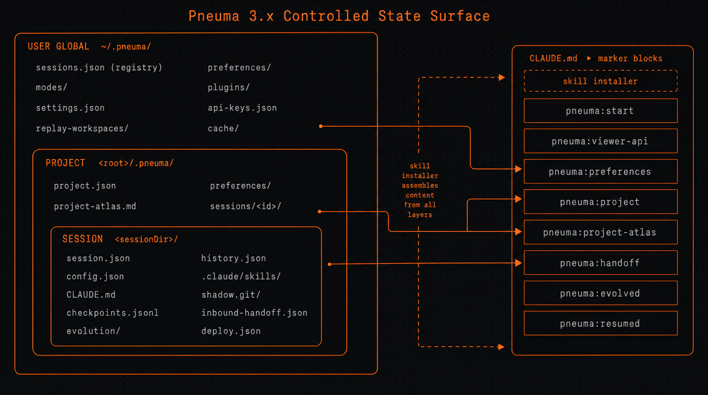

# Pneuma 受控状态全景 (3.x)

> Last updated: 2026-04-30

> 本文回答一个问题：**"Pneuma 在用户磁盘上到底管了哪些东西？"** —— 把所有 Pneuma 会读、会写、会清理的文件和目录拉到同一张图里，标清楚归属、生命周期、和层与层之间的协作关系。其他文档（README / CLAUDE.md / viewer-agent-protocol）讲架构和协议；这篇只讲**状态在哪、谁能动它、什么时候被改写**。



## TL;DR

- Pneuma 的所有持久化状态分**三层同心圆**：用户全局 (`~/.pneuma/`) → 项目 (`<projectRoot>/.pneuma/`) → 会话 (`<sessionDir>/`)。
- **磁盘是 single source of truth**；任何 registry / index / 缓存都可以从磁盘扫回来。
- Skill 安装的指令文件 (`CLAUDE.md` / `AGENTS.md`) 是各层信息汇聚的**装配台**——通过命名 marker block 拼装，每个 block 由不同子系统负责注入。
- Quick session（无 project）和 project session 走同一份代码，区别只在 `sessionDir` 在哪。

---

## 三层同心圆

### Layer 1 — 用户全局 `~/.pneuma/`

跨项目、跨会话、跨机器（如有 dotfile 同步）共享的状态。

| 路径 | 含义 | Owner | 生命周期 |
|------|------|-------|---------|
| `sessions.json` | 全局 registry（3.0 schema：`{ projects[], sessions[] }`） | Launcher / per-session server | 每次 mode launch / project create 时 upsert，cap 50 项目 + 50 会话 |
| `preferences/profile.md` | 跨模式个人偏好（agent 维护） | Agent (`pneuma-preferences` skill) | 用户对话中由 agent 增量更新；启动时 `pneuma-critical:start/end` 块被抽出注入 |
| `preferences/mode-{name}.md` | 单模式个人偏好 | Agent | 同上 |
| `modes/<user>-<repo>/` 或 `modes/<name>/` | 外部 mode 的解压目录 | `pneuma mode add` | 安装时创建，`pneuma mode remove` 删除 |
| `plugins/<name>/` | 外部 plugin 解压目录 | `pneuma plugin add` | 同上 |
| `settings.json` | Plugin 设置 + 全局偏好 | Plugin SettingsManager | 由 launcher UI 写入 |
| `api-keys.json` / `r2.json` / `cloudflare-pages.json` | 服务凭据 | 用户手动配置 / launcher 表单 | 长期持有；不轮换 |
| `replay-workspaces/<id>/` | Replay 包解压临时根 | History replay 模块 | `pneuma history open` 时创建；用完保留以便复用 |
| `cache/` | 杂项缓存（图片、构建产物等） | 多模块共享 | 可随时清空，不影响功能正确性 |
| `scheduled_tasks.json`*, `scheduled_tasks.lock`* | 计划任务（如有） | （非核心子系统） | 调度模块自管 |

**关键不变量**

- `sessions.json` 只允许 launcher 单写者访问（per-session server 走 launcher API），避免并发覆盖。
- 任何 secret 文件（`api-keys.json`, `r2.json`, `cloudflare-pages.json`）**永远不会**被 export / replay package 打包带走。

---

### Layer 2 — 项目 `<projectRoot>/.pneuma/`

Pneuma 3.0 引入。`<projectRoot>/.pneuma/project.json` 的存在 = "这个目录是一个 Pneuma project"。

| 路径 | 含义 | Owner | 生命周期 |
|------|------|-------|---------|
| `project.json` | `ProjectManifest`：name / displayName / description / createdAt | Launcher (`POST /api/projects`) | 项目创建时写一次；description 由 agent 偶尔更新 |
| `preferences/profile.md` | 项目作用域跨模式偏好 | Agent (`pneuma-preferences` skill, project scope) | 启动时 `pneuma-critical` 块抽出，注入到 `pneuma:project` 块 |
| `preferences/mode-{name}.md` | 项目作用域单模式偏好 | Agent | 同上 |
| `project-atlas.md` | 项目 briefing：scope / 受众 / 约定 / 决定 / 开放线程 | `project-evolve` mode 的 agent | Project chip 的 Evolve sparkle 触发；评审通过后落盘 |
| `sessions/<sessionId>/` | 单个会话的状态目录（详见 Layer 3） | Per-session server + agent | 创建会话时 mkdir；归档时整目录搬移 |
| `sessions/<sessionId>/.pneuma/inbound-handoff.json` | 入站 handoff payload（来自其他会话） | Launcher (`/api/handoffs/:id/confirm`) → 目标会话 agent | 目标 spawn 前由 server 原子写入；目标 agent 第一轮读取并 `rm` |

**关键不变量**

- `<projectRoot>` 本身是用户内容目录（agent 在这里写交付物）；Pneuma 只占领 `.pneuma/` 子目录。
- `project-atlas.md` 是 **pointer-style** 注入：CLAUDE.md 里只放路径 + mtime + 摘要，agent 第一轮自己 Read 全文，避免每个 session 的 prompt 膨胀。
- 项目作用域偏好和个人偏好是**正交**的：两层都会注入，hard constraint 各占一个 marker block（`pneuma:preferences` vs `pneuma:project`）。

---

### Layer 3 — 会话 `<sessionDir>/`

`sessionDir` 的位置取决于会话归属：

- **Quick session**（裸 workspace）：`sessionDir = <workspace>/.pneuma/`（legacy 2.x 布局）
- **Project session**：`sessionDir = <projectRoot>/.pneuma/sessions/<sessionId>/`（**扁平**，不嵌套 `.pneuma/`，agent 的 CWD = `sessionDir`）

| 路径 | 含义 | Owner | 生命周期 |
|------|------|-------|---------|
| `session.json` | sessionId / agentSessionId / mode / backendType / createdAt | Per-session server | 启动时写；agentSessionId 在 backend 首次响应时回填 |
| `history.json` | 完整对话历史（含 tool calls、partial messages、hook events） | Per-session server | 每 5 秒自动保存；进程退出前 flush |
| `config.json` | 模式 init 参数（slideWidth、API 选择等） | Mode viewer / launcher 表单 | 启动时写一次；少量场景可热更新 |
| `skill-version.json` | `{ mode, version }` —— 已安装 skill 版本 | Skill installer | 每次 install 后写入 |
| `skill-dismissed.json` | 用户已 dismiss 的 skill 更新版本号 | Launcher 提示流 | 用户点 Skip 时写入 |
| `shadow.git/` | bare git 仓库，跟踪 workspace 每轮变化 | Shadow-git 模块 | 启动时 init；每个 turn 提交一次 |
| `checkpoints.jsonl` | 检查点索引：每行 `{ turn, ts, hash }` | Shadow-git 模块 | 每个 turn 末尾追加 |
| `replay-checkout/` | Replay 时按 hash 检出文件的临时目录 | Replay 模块 | 每次切换 checkpoint 前清空再写 |
| `resumed-context.xml` | 从 replay 包继续工作时的上下文注入 | History 模块 | 仅在 "Continue Work" 时存在 |
| `evolution/` | 演化提案、备份、CLAUDE.md 快照 | Evolution mode | 由 evolve / project-evolve 写入 |
| `deploy.json` | Deploy 绑定（按 contentSet 索引）：`{ vercel: {...}, cfPages: {...} }` | Deploy plugin | 每次 deploy 成功后更新 |
| `.claude/skills/<installName>/` | Claude 后端的 skill 安装目录 | Skill installer | 启动时 copy + 模板替换 |
| `.agents/skills/<installName>/` | Codex 后端的 skill 安装目录 | Skill installer | 同上 |
| `CLAUDE.md` | Claude 后端的指令装配台（见下） | Skill installer | 启动时拼装；启动后由部分子系统增量更新 |
| `AGENTS.md` | Codex 后端的指令装配台 | Skill installer | 同上 |

**关键不变量**

- `<sessionDir>` 即 agent 的 CWD（project session）或 `<workspace>` 即 agent 的 CWD（quick session）。所有相对路径以此为基准。
- `shadow.git/` 的所有写操作通过 Promise chain 串行化，避免 `index.lock` 冲突。
- session 删除 = 直接 `rm -rf <sessionDir>`，不需要先调 server API。

---

## 横切关注点

### Skill 安装与指令装配

每次启动时，`server/skill-installer.ts` 把 mode 的 skill 目录 copy 到 `<sessionDir>/.claude/skills/<installName>/`（或 `.agents/skills/`），然后在 `CLAUDE.md` / `AGENTS.md` 上拼装一组**命名 marker block**——每个 block 由不同子系统负责填充，互相正交。

| Marker block | 来源 | 仅 project session？ |
|--------------|------|--------------------|
| `pneuma:start` / `end` | 当前 mode 的 SKILL.md 主体（mode 描述、架构、核心规则） | 否 |
| `pneuma:viewer-api:start` / `end` | Viewer API 文档（context / actions / scaffold / locator / native APIs） | 否 |
| `pneuma:preferences:start` / `end` | `~/.pneuma/preferences/` 抽出的 hard constraint | 否 |
| `pneuma:project:start` / `end` | `<projectRoot>/.pneuma/project.json` 摘要 + 项目偏好 hard constraint | **是** |
| `pneuma:project-atlas:start` / `end` | `<projectRoot>/.pneuma/project-atlas.md` 的 **pointer**（path + mtime + size + 摘要） | **是** |
| `pneuma:handoff:start` / `end` | `<sessionDir>/.pneuma/inbound-handoff.json` 的内容（intent / suggested files） | **是** |
| `pneuma:evolved:start` / `end` | Evolution 系统学到的偏好（写在 `pneuma:start/end` 内） | 否 |
| `pneuma:resumed:start` / `end` | Replay → Continue Work 时的上下文 | 否 |

**正交设计**：每个 block 是独立的 reader/writer 域。Evolution 写 `pneuma:evolved` 不会影响 handoff 的 `pneuma:handoff`；用户重启会话时整个文件被重建，但 dismissed 的 skill 更新版本通过 `skill-dismissed.json` 持久化，不依赖 `CLAUDE.md` 内容。

### Handoff 数据流

跨 session / mode 协作的物理载体是磁盘文件。

```
源 session 的 agent
        │ pneuma handoff --json '{...}' （CLI 工具）
        ▼
Launcher (POST /api/handoffs/emit)
        │ store in Map<id, HandoffProposal> (in-memory, 30min TTL)
        │ broadcast handoff_proposed → 源 session 的浏览器
        ▼
HandoffCard 渲染 → 用户 confirm
        │
        ▼
Server (/api/handoffs/:id/confirm):
        1. 原子写 <targetSessionDir>/.pneuma/inbound-handoff.json
        2. best-effort kill 源 backend
        3. 写 switched_out / switched_in 历史事件
        4. spawn 目标 session
        ▼
目标 session 启动
        │ skill installer 把 inbound-handoff.json 内容
        │ 注入到 CLAUDE.md 的 pneuma:handoff 块
        ▼
目标 agent 第一轮读取 + rm 文件
```

### 演化（Evolution）

Personal evolve 和 project-evolve 共享一套 dashboard：

- Personal `evolve` mode：写入 `<sessionDir>/evolution/`，作用域是当前 mode 的 SKILL.md 增强。
- `project-evolve` mode：写入 `<pneumaProjectRoot>/.pneuma/evolution/`（注意 server 启动时把 `stateDir` 重定向到了项目根），目标是 `project-atlas.md` 等项目级文档。

提案 → 评审 → Apply 走同一条 `/api/evolve/proposals*` 流水线，区别只在 `workspace` 与 `stateDir` 选择。

---

## 生命周期速查

| 事件 | 受影响的状态 |
|------|-------------|
| 项目创建 (`POST /api/projects`) | `<root>/.pneuma/project.json` 写入；`sessions.json` 的 `projects[]` upsert |
| 会话启动 | `session.json` / `skill-version.json` / `.claude/skills/` / `CLAUDE.md` 写入；`shadow.git` init；`sessions.json` 的 `sessions[]` upsert |
| 每个 turn | `history.json` 5 秒后自动保存；`shadow.git` 提交；`checkpoints.jsonl` 追加 |
| 偏好 / atlas 更新 | 由 agent 直接编辑对应 `.md` 文件；下次启动时被重新抽取注入 |
| Handoff confirm | 目标 `<sessionDir>/.pneuma/inbound-handoff.json` 写入；源 backend kill；source/target 双方 history 各加一条事件 |
| Skill update / dismiss | `skill-version.json` / `skill-dismissed.json` 写入 |
| Replay open | `<replay-workspaces>/<id>/` 解压；切 checkpoint 时 `replay-checkout/` 重写 |
| 项目归档 | `sessions.json` 中条目的 `archived: true`；磁盘文件**不动** |
| 项目删除 | 用户手动 `rm -rf <root>/.pneuma/`；下次 launcher 扫盘时 reconcile 掉 |

---

## 设计原则

1. **磁盘是 single source of truth**。`sessions.json` 不是权威，是 index/cache：launcher 启动时可以重新扫盘恢复 `projects[]`（已规划的 v2→v3 migration），每个 project 的 metadata 始终从 `<root>/.pneuma/project.json` 现读，避免和 registry 里的拷贝漂移。
2. **三层同心圆，每层独立可重建**。Layer 1 丢了不影响 Layer 2/3 的可恢复性；删了某个 session 不影响项目本身。
3. **Marker block 装配模型**。指令文件的内容是子系统协作产物——每个 marker block 是独立的责任域，谁写谁负责，正交不冲突。
4. **Pointer 优先于 inline**。大文件（atlas、handoff payload）走 pointer 注入：CLAUDE.md 里放路径 + 摘要，agent 自己 Read。Prompt 体积可控，状态变化无需重启。
5. **Skill 是状态的语义层**。`pneuma-preferences` / `pneuma-project` / mode 自己的 skill 把"知道这个文件存在 + 怎么用"教给 agent；server 只负责把文件放对位置。

---

## 不在 Pneuma 控制下

明确一下边界：以下东西 Pneuma **不管**，避免误以为它会替你做。

- **用户的交付物文件**：deck 内容、文档正文、组件代码——agent 直接 Read/Edit/Write，Pneuma 只是观察 chokidar 推过来的事件。
- **用户项目自己的 git**：`shadow.git/` 是 Pneuma 自己的 bare 仓库，跟用户在 `<root>/.git/` 的 git 完全独立。
- **Backend 的私有 state**：Claude Code 的 `~/.claude/`、Codex 的会话存储——Pneuma 只通过 stdio 跟它说话，不读它的内部文件。
- **跨机器同步**：`~/.pneuma/` 默认本机；用户自己用 dotfile 工具同步要自担风险（registry / preferences 可同步，secret 文件建议排除）。

---

## 相关文档

- [`viewer-agent-protocol.md`](./viewer-agent-protocol.md) — Viewer / User / Agent 三方协议
- [`network-topology.md`](./network-topology.md) — 端口与进程拓扑
- [`docs/design/2026-04-27-pneuma-projects-design.md`](../design/2026-04-27-pneuma-projects-design.md) — Project layer 完整设计
- [`docs/design/2026-04-28-handoff-tool-call.md`](../design/2026-04-28-handoff-tool-call.md) — Handoff 协议设计
