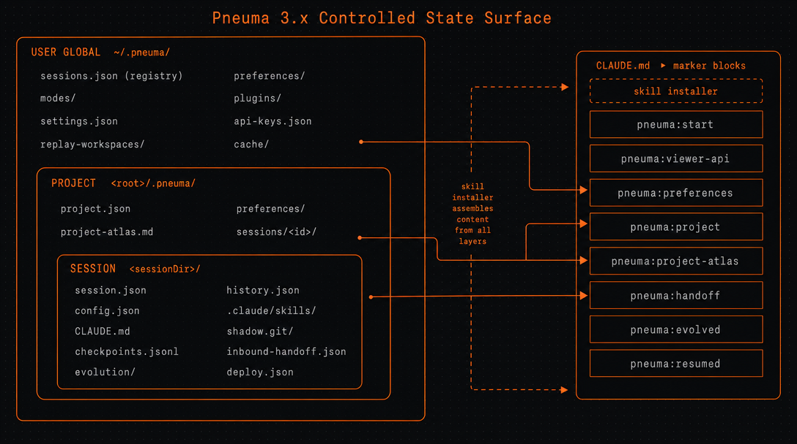

# Pneuma 受控状态全景

> 本文回答一个问题：**Pneuma 在用户磁盘上到底管了哪些东西？** 把所有 Pneuma 会读、会写、会清理的文件与目录拉到同一张图，标清归属、生命周期、层与层之间的协作关系。其他文档讲架构和协议，这篇只讲**状态在哪、谁能动它、什么时候被改写**。



## TL;DR

- Persistent state has three scopes: global (`~/.pneuma/`), project (`<projectRoot>/.pneuma/`), and session (`<stateDir>/`). The path table below distinguishes the session working directory from its state directory.
- **State ownership is explicit.** `sessions.json` records which projects and sessions are registered; project and session files hold their own metadata and content. The launcher does not discover unregistered projects by scanning arbitrary directories. Restore a project's registration with `pneuma project add <path>` or Create Project on the same path.
- Skill 安装的指令文件 (`CLAUDE.md` / `AGENTS.md`) 是各层信息汇聚的**装配台**——通过命名 marker block 拼装，每个 block 由不同子系统负责注入。
- Quick and project sessions share runtime machinery, with different path layouts and project capabilities. Resolve paths through `core/path-resolver-pneuma.ts::resolveSessionPaths`.

---

## 三层同心圆

### Layer 1 — 用户全局 `~/.pneuma/`

跨项目、跨会话、跨机器（如有 dotfile 同步）共享的状态。

| 路径 | 含义 | Owner | 生命周期 |
|------|------|-------|---------|
| `sessions.json` | Registered projects and sessions (`{ projects[], sessions[] }`); includes registry-owned state such as project `archived` flags | CLI / launcher / per-session server | Launch, project registration, and management routes update it; `upsertProject` and `upsertSession` each default to a cap of 200 |
| `preferences/profile.md` | 跨模式个人偏好（agent 维护） | Agent (`pneuma-preferences` skill) | 用户对话中由 agent 增量更新；启动时 `pneuma-critical:start/end` 块被抽出注入 |
| `preferences/mode-{name}.md` | 单模式个人偏好 | Agent | 同上 |
| `modes/<user>-<repo>/` or `modes/<name>/` | Installed external modes | `pneuma mode add` / launcher | Created on install; launcher removal uses `DELETE /api/modes/:name` |
| `plugins/<name>/` | Installed external plugins | `pneuma plugin add` / `pneuma plugin remove` | Created on install; removed by the plugin CLI |
| `settings.json` | Plugin 设置 + 全局偏好 | Plugin SettingsManager | 由 launcher UI 写入 |
| `api-keys.json` / `r2.json` / `cloudflare-pages.json` | 服务凭据 | 用户手动配置 / launcher 表单 | 长期持有；不轮换 |
| `replay-workspaces/<id>/` | Replay 包解压临时根 | History replay 模块 | `pneuma history open` 时创建；用完保留以便复用 |
| `bin/pneuma-<hash>` | `$PNEUMA_CLI` 的 sh wrapper——单一无空格可执行路径，内部引号写死真实 runtime + entry；按 (runtime, entry) 哈希命名，一个安装形态一份 | `bin/cli-wrapper.ts`（session boot 时幂等重写） | 每次 session 启动 ensure；可随时删除，下次启动重建 |
| `cache/` | 杂项缓存（图片、构建产物等） | 多模块共享 | 可随时清空，不影响功能正确性 |
| `scheduled_tasks.json`*, `scheduled_tasks.lock`* | 计划任务（如有） | （非核心子系统） | 调度模块自管 |

**关键不变量**

- Registry writers use `bin/sessions-registry.ts::writeSessionsFile` or its synchronous counterpart: write a unique temporary sibling, then rename it over `sessions.json`. Multiple processes write directly. Atomic replacement prevents partial file reads; it does **not** serialize concurrent read-modify-write operations or prevent lost updates.
- The launcher enriches **registered** projects by scanning their session directories through `server/projects-cache.ts` and `core/project-loader.ts::scanProjectSessions`. This does not discover unregistered project roots or reconstruct registry-only state.
- 任何 secret 文件（`api-keys.json`, `r2.json`, `cloudflare-pages.json`）**永远不会**被 export / replay package 打包带走。

---

### Layer 2 — 项目 `<projectRoot>/.pneuma/`

Pneuma 3.0 引入。`<projectRoot>/.pneuma/project.json` 的存在 = "这个目录是一个 Pneuma project"。

| 路径 | 含义 | Owner | 生命周期 |
|------|------|-------|---------|
| `project.json` | `ProjectManifest`: project identity, description, creation and onboarding metadata | Project routes / `pneuma project add` | Created or registered explicitly; onboarding and project updates can rewrite it |
| `preferences/profile.md` | 项目作用域跨模式偏好 | Agent (`pneuma-preferences` skill, project scope) | 启动时 `pneuma-critical` 块抽出，注入到 `pneuma:project` 块 |
| `preferences/mode-{name}.md` | 项目作用域单模式偏好 | Agent | 同上 |
| `project-atlas.md` | Project briefing: scope, audience, conventions, decisions, and open threads | Project onboarding / `project-evolve` | Onboarding seeds it; reviewed project evolution can update it |
| `sessions/<sessionId>/` | One project session's working and state directory (Layer 3) | Per-session server + agent | Created for the session; project archive leaves it in place; session deletion removes it |
| `sessions/<sessionId>/.pneuma/inbound-handoff.json` | Inbound handoff payload | Handoff / onboarding routes → target agent | Staged before target spawn; the target agent reads and consumes it |

**关键不变量**

- `<projectRoot>` 本身是用户内容目录（agent 在这里写交付物）；Pneuma 只占领 `.pneuma/` 子目录。
- `project-atlas.md` 是 **pointer-style** 注入：CLAUDE.md 里只放路径 + mtime + 摘要，agent 第一轮自己 Read 全文，避免每个 session 的 prompt 膨胀。
- 项目作用域偏好和个人偏好是**正交**的：两层都会注入，hard constraint 各占一个 marker block（`pneuma:preferences` vs `pneuma:project`）。

---

### Layer 3 — Session working and state directories

`sessionDir` is the agent's CWD and skill-install target. `stateDir` holds runtime
metadata. They are equal only for project sessions:

| Path | Quick session | Project session |
|------|---------------|-----------------|
| `sessionDir` / agent CWD | `<workspace>` | `<projectRoot>/.pneuma/sessions/<sessionId>` |
| `stateDir` | `<workspace>/.pneuma` | Same as `sessionDir` |
| `homeRoot` / deliverable root | `<workspace>` | `<projectRoot>` |
| Skills and instructions | Under `sessionDir` | Under `sessionDir` |
| Inbound handoff | `<sessionDir>/.pneuma/inbound-handoff.json` | `<sessionDir>/.pneuma/inbound-handoff.json` |

Definition: [`SessionPaths` and `resolveSessionPaths`](../../core/path-resolver-pneuma.ts).
The runtime-state paths in the following table are relative to **`stateDir`**:

| 路径 | 含义 | Owner | 生命周期 |
|------|------|-------|---------|
| `session.json` | sessionId / agentSessionId / mode / backendType / createdAt | Per-session server | 启动时写；agentSessionId 在 backend 首次响应时回填 |
| `history.json` | 完整对话历史（含 tool calls、partial messages、hook events） | Per-session server | 每 5 秒自动保存；进程退出前 flush |
| `config.json` | 模式 init 参数（slideWidth、API 选择等） | Mode viewer / launcher 表单 | 启动时写一次；少量场景可热更新 |
| `skill-version.json` | `{ mode, version }` —— 已安装 skill 版本 | Skill installer | 每次 install 后写入 |
| `skill-dismissed.json` | 用户已 dismiss 的 skill 更新版本号 | Launcher 提示流 | 用户点 Skip 时写入 |
| `shadow.git/` | bare git 仓库，跟踪 workspace 每轮变化 | Shadow-git 模块 | 启动时 init；每个 turn 提交一次 |
| `checkpoints.jsonl` | 检查点索引：每行 `{ turn, ts, hash }` | Shadow-git 模块 | 每个 turn 末尾追加 |
| `replay-checkout/` | Replay 时按 hash 检出文件的临时目录 | Replay 模块 | 每次切换 checkpoint 前清空再写 |
| `resumed-context.xml` | 从 replay 包继续工作时的上下文注入 | History 模块 | 仅在 "Continue Work" 时存在 |
| `evolution/` | Personal skill-evolution proposals, backups, and instruction snapshots | `evolve` | Project-evolution proposals use the project scope described below |
| `deploy.json` | Deploy 绑定（按 contentSet 索引）：`{ vercel: {...}, cfPages: {...} }` | Deploy plugin | 每次 deploy 成功后更新 |

Skills and instructions are relative to **`sessionDir`**, using the selected
`BackendModule`'s `skillsDir` and `instructionsFile`:

| Backend | Skill path | Instructions |
|---------|------------|--------------|
| Claude Code | `.claude/skills/<installName>/` | `CLAUDE.md` |
| Codex | `.agents/skills/<installName>/` | `AGENTS.md` |
| Kimi | `.kimi-code/skills/<installName>/` | `AGENTS.md` |

**关键不变量**

- The agent's relative paths resolve from `sessionDir` in both layouts. Do not derive state-file paths by appending `.pneuma` unconditionally: use `stateDir`.
- `shadow.git/` 的所有写操作通过 Promise chain 串行化，避免 `index.lock` 冲突。
- Project session deletion uses `DELETE /api/projects/:id/sessions/:sessionId`, which removes its registry entry, attempts directory removal, and refreshes the project cache. Directory-removal errors are currently logged. Deleting the directory alone leaves registry state behind. A quick session's `sessionDir` is the user's workspace, so it is not a metadata-only deletion target.

---

## 横切关注点

### Skill 安装与指令装配

When skill installation runs, `server/skill-installer.ts` copies the mode's skill
to `<sessionDir>/<BackendModule.skillsDir>/<installName>/` and updates named
marker blocks in `<sessionDir>/<BackendModule.instructionsFile>`. Resume can
retain the installed skill version; see [Skill Installation & Update Detection](project-guide.md#skill-installation--update-detection).

| Marker block | 来源 | 仅 project session？ |
|--------------|------|--------------------|
| `pneuma:start` / `end` | Scene, runtime/backend identity, and a pointer to the mode's SKILL.md; detailed guidance stays in the skill | No |
| `pneuma:viewer-api:start` / `end` | Viewer API entry points and available actions, with pointers to mode guidance and proxy descriptions | No |
| `pneuma:preferences:start` / `end` | `~/.pneuma/preferences/` 抽出的 hard constraint | 否 |
| `pneuma:project:start` / `end` | `<projectRoot>/.pneuma/project.json` 摘要 + 项目偏好 hard constraint | **是** |
| `pneuma:project-atlas:start` / `end` | `<projectRoot>/.pneuma/project-atlas.md` 的 **pointer**（path + mtime + size + 摘要） | **是** |
| `pneuma:handoff:start` / `end` | A rendered inbound handoff brief from `<sessionDir>/.pneuma/inbound-handoff.json`; a borrow brief takes precedence when present | No; handoffs support quick and project sessions |
| `pneuma:evolved:start` / `end` | Evolution 系统学到的偏好（写在 `pneuma:start/end` 内） | 否 |
| `pneuma:resumed:start` / `end` | Replay → Continue Work 时的上下文 | 否 |

Each marker block has a named owner. The installer reads the existing
instructions file and replaces or removes its managed blocks while preserving
unmanaged text. Nested content inside a replaced block follows that block's
lifecycle; do not assume it survives reinstallation. Skill version and dismissal
state live in `skill-version.json` and `skill-dismissed.json` under `stateDir`.

### Handoff 数据流

跨 session / mode 协作的物理载体是磁盘文件。

```
源 session 的 agent
        │ pneuma handoff --json '{...}' （CLI 工具）
        ▼
Source session server (POST /api/handoffs/emit)
        │ store in Map<id, HandoffProposal> (in-memory, 30min TTL)
        │ broadcast handoff_proposed → 源 session 的浏览器
        ▼
HandoffCard 渲染 → 用户 confirm
        │
        ▼
Server (/api/handoffs/:id/confirm):
        1. 原子写 <targetSessionDir>/.pneuma/inbound-handoff.json
        2. best-effort kill 源 backend
        3. 写 switched_out / switched_in 历史事件
        4. spawn 目标 session
        ▼
目标 session 启动
        │ skill installer 把 inbound-handoff.json 内容
        │ 注入到 CLAUDE.md 的 pneuma:handoff 块
        ▼
目标 agent 第一轮读取 + rm 文件
```

The history steps above describe project handoffs. A quick handoff reuses the
workspace for a new quick session: it does not create a project or retain the
source conversation as a separate project session, and it skips the source's
`switched_out` event. See [Cross-Mode Handoff Protocol](project-guide.md#cross-mode-handoff-protocol).

### 演化（Evolution）

Personal evolve 和 project-evolve 共享一套 dashboard：

- Personal `evolve` stores proposals under `<stateDir>/evolution/` and proposes additions or removals to the target mode's skill guidance.
- `project-evolve` stores proposals under `<projectRoot>/.pneuma/evolution/` and targets project-level files such as `project-atlas.md`. Only the evolution routes receive the project root and project state directory overrides; the session's own history and runtime state remain session-scoped.

提案 → 评审 → Apply 走同一条 `/api/evolve/proposals*` 流水线，区别只在 `workspace` 与 `stateDir` 选择。

---

## 生命周期速查

| 事件 | 受影响的状态 |
|------|-------------|
| 项目创建 (`POST /api/projects`) | `<root>/.pneuma/project.json` 写入；`sessions.json` 的 `projects[]` upsert |
| Session launch / resume | Session metadata under `stateDir`; skills and instructions under `sessionDir` when installation runs; shadow-git initialization and registry upsert as applicable |
| 每个 turn | `history.json` 5 秒后自动保存；`shadow.git` 提交；`checkpoints.jsonl` 追加 |
| 偏好 / atlas 更新 | 由 agent 直接编辑对应 `.md` 文件；下次启动时被重新抽取注入 |
| Handoff confirm | Stage the target's inbound file before spawn; best-effort source backend teardown; project handoffs also retain switch history |
| Skill update / dismiss | `skill-version.json` / `skill-dismissed.json` 写入 |
| Replay open | `<replay-workspaces>/<id>/` 解压；切 checkpoint 时 `replay-checkout/` 重写 |
| 项目归档 | `sessions.json` 中条目的 `archived: true`；磁盘文件**不动** |
| Project session deletion | `DELETE /api/projects/:id/sessions/:sessionId` removes the registry row, attempts session-directory removal, and refreshes the project cache |
| Project deletion | `DELETE /api/projects/:id` removes project/session registry rows and `<root>/.pneuma/`; user files outside `.pneuma/` remain. Disk deletion failures are reported after registry removal |

---

## 设计原则

1. **Name the authority for each state.** `sessions.json` owns registration and registry-only fields such as archive state; `project.json` and per-session files own their respective metadata and content. Atomic persistence is not automatic discovery or conflict-free concurrent writing.
2. **Recovery is scoped and explicit.** Losing the global registry does not erase project files, but registration must be restored explicitly and registry-only metadata is not reconstructed by scanning sessions. Deleting a project session leaves the project and its shared deliverables in place.
3. **Marker block 装配模型**。指令文件的内容是子系统协作产物——每个 marker block 是独立的责任域，谁写谁负责，正交不冲突。
4. **Use pointers for larger guidance.** The mode skill and project atlas are referenced from the instructions file. Handoff briefs currently render selected payload fields inline and retain a path to the source file; a pointer does not imply that changes to a file are automatically re-read by the agent.
5. **Skill 是状态的语义层**。`pneuma-preferences` / `pneuma-project` / mode 自己的 skill 把"知道这个文件存在 + 怎么用"教给 agent；server 只负责把文件放对位置。

---

## 不在 Pneuma 控制下

明确一下边界：以下东西 Pneuma **不管**，避免误以为它会替你做。

- **用户的交付物文件**：deck 内容、文档正文、组件代码——agent 直接 Read/Edit/Write，Pneuma 只是观察 chokidar 推过来的事件。
- **用户项目自己的 git**：`shadow.git/` 是 Pneuma 自己的 bare 仓库，跟用户在 `<root>/.git/` 的 git 完全独立。
- **Backend 的私有 state**：Claude Code 的 `~/.claude/`、Codex 的会话存储——Pneuma 只通过 stdio 跟它说话，不读它的内部文件。
- **跨机器同步**：`~/.pneuma/` 默认本机；用户自己用 dotfile 工具同步要自担风险（registry / preferences 可同步，secret 文件建议排除）。

---

## 相关文档

- [`viewer-agent-protocol.md`](./viewer-agent-protocol.md) — Viewer / User / Agent 三方协议
- [`network-topology.md`](./network-topology.md) — 端口与进程拓扑
- [`docs/archive/proposals/2026-04-27-pneuma-projects-design.md`](../archive/proposals/2026-04-27-pneuma-projects-design.md) — Project layer 完整设计
- [`docs/archive/proposals/2026-04-28-handoff-tool-call.md`](../archive/proposals/2026-04-28-handoff-tool-call.md) — Handoff 协议设计
