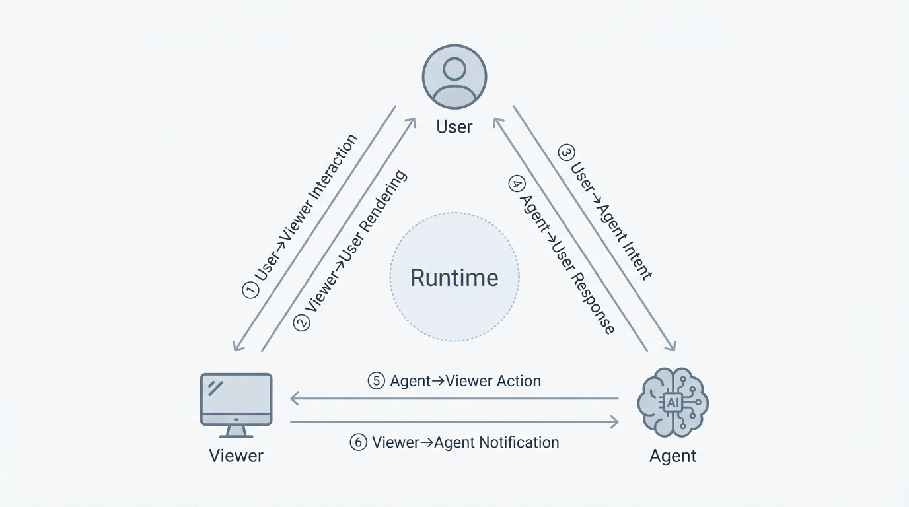
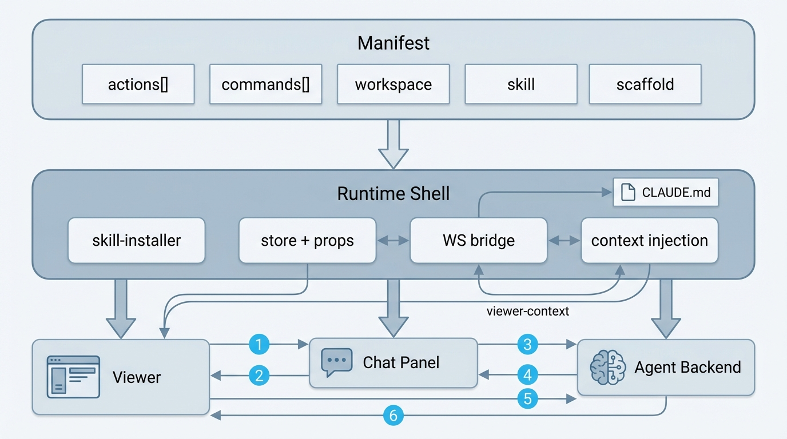

# Viewer–Agent Protocol Architecture

> Pneuma 的核心通信模型。三个参与方之间有 6 个通信方向，每个方向有明确的职责和契约。

## 基本立场

Pneuma 的协议建立在一条基本立场上：**coding agent（Claude Code / Codex）直接在 workspace 的文件上干活，这是它的母语，不被中介也不被替代。** `pneuma-3.0-design.md` 把这条立场推到终点：Viewer 不是一个文件预览器，而是一个 **针对特定任务的 player + 可选参与面板**——人通过它实时观察 agent 的工作、在需要时直接介入（拖、删、重排）或通过结构化命令提建议。

这带来三层正交的关注点：

| 层 | 归谁 | 服务谁 | 动词 |
|---|---|---|---|
| **Layer 1 — 文件系统** | Agent 的母语 | Claude Code / Codex 通过 Read/Edit/Write 工具跟世界对话 | read / edit / write file by path |
| **Layer 2 — 传输** | Runtime 基础设施 | 把 Layer 1 的变化变成可订阅的事件流 | chokidar → pendingSelfWrites → WS → event bus |
| **Layer 3 — Source** | Viewer 的输入/输出协议 | mode 作者写 viewer 时只看这一层，用 domain 类型订阅 | `Source<T>.subscribe` / `write`，T 是 domain 而非 file shape |

本文档描述的是 **Viewer / User / Agent 三方之间** 的 6 个通信方向（下面的 ① ~ ⑥）。Layer 3 的 **Source 协议** 是 viewer 和 runtime 之间的契约，跟 6 方向正交——Viewer 通过 Source 消费 agent 在 workspace 上的工作成果，再通过 6 方向里的其他通道跟 User / Agent 交互。Source 协议本身有专门一节在本文档末尾描述。

## 协议总览



## 三方角色

| 角色 | 实体 | 职责 |
|------|------|------|
| **User** | 浏览器中的人类 | 观察 viewer 播放、选择元素、输入消息、审批权限、按需参与 |
| **Viewer** | Mode 级 React 组件 | 把 agent 的工作成果以 domain 语言渲染成实时 player；捕获用户交互；执行 Agent 请求的操作；主动上报观测 |
| **Agent** | Claude Code / Codex 进程 | 理解意图、**直接编辑 workspace 文件**、调用工具、请求 Viewer 操作 |

---

## 6 个通信方向

### ① User → Viewer: Interaction（交互输入）

用户在预览面板中的一切操作 — 选择元素、切换页面、调整视口、点击命令按钮。

**系统支撑:**
- Viewer 内部捕获用户交互事件，通过回调上报给 Runtime
- Viewer 根据 `props.commands` 渲染可触发的命令 UI，用户点击后 Viewer 经 ⑥ 通道发送给 Agent

**数据契约:**
- `onSelect(selection)` — 用户选中元素
- `onActiveFileChange(file)` — 用户切换查看文件
- `onViewportChange(viewport)` — 用户滚动/翻页时的视口变更
- `commands: ViewerCommandDescriptor[]` — 可触发的命令列表（runtime 从 manifest 注入）

---

### ② Viewer → User: Rendering（视觉呈现 / Player）

Viewer 把 agent 在 workspace 上的工作成果渲染为用户可见的实时 player。这是这个系统的主流数据流——**agent 持续在背后编辑文件，每一次编辑都通过 Layer 2 变成一个带 origin 的 Source 事件到达 viewer，viewer 据此刷新画面、滚动到新元素、高亮变化。** viewer 的首要人格是「player / 观察器」，不是「编辑器」。

**系统支撑:**
- Viewer 通过 `props.sources` 订阅运行时实例化的 `Source<T>` 句柄；`T` 是 mode 定义的 domain 类型（`Deck`、`Board`、`Project`……），不是原始文件数组
- 每个 Source 事件带 `origin` 标记：`"initial"`（首次快照）、`"external"`（agent 或其他 writer）、`"self"`（本 viewer 自己的 write 回声）——viewer 据此决定要不要重挂载 domain store、要不要高亮「刚被 agent 改过」、要不要忽略自己的 echo
- Content set 切换、文件导航、视口管理等 UI 状态由 Viewer 自主管理

**数据契约:**
- `sources: Record<string, Source<T>>` — runtime 根据 `manifest.sources` 声明实例化的 typed 数据通道 map；viewer 通过 `useSource` hook 订阅（参见末尾 Sources 小节）
- `contentVersion` / `imageVersion` — 变更信号，用于缓存失效
- `workspaceItems: WorkspaceItem[]` — 结构化的工作区项（由 workspace model 计算）

> **历史注记**：在 Source 抽象引入之前，viewer 接收一个原子的 `files: ViewerFileContent[]` prop，每个 viewer 自己去 `files.find(...)` 定位自己关心的文件、自己维护 echo-skip 的 ref。Source 协议把这些 storage 细节关进 provider，让 viewer 直接消费 domain 类型。见文档末尾 "Sources — Viewer 的数据通道"。

---

### ③ User → Agent: Intent（意图表达）

用户通过聊天告诉 Agent 想要什么 — 自然语言消息和附件。

**系统支撑:**
- Chat Panel 发送文本消息 + 图片/文件附件，通过 WebSocket 传输 `user_message`
- Viewer 提供的上下文信息（选中元素、视口位置等）由 ⑥ 通道注入，不属于本方向

**数据契约:**
- `user_message` — 用户消息（text + images + files）

---

### ④ Agent → User: Response（响应反馈）

Agent 的思考过程、文字回复、工具调用状态、以及需要用户审批的权限请求。

**系统支撑:**
- WebSocket streaming — Agent 输出通过 WS bridge 实时推送到浏览器
- Chat Panel 渲染 assistant messages、tool blocks、thinking blocks
- Permission Banner 渲染 `permission_request`（工具审批 + AskUserQuestion）

**数据契约:**
- `assistant_message` — Agent 文字回复（streaming content blocks）
- `tool_use` / `tool_result` — 工具调用和结果
- `permission_request` / `permission_response` — 权限审批循环
- `ViewerLocator` — Agent 消息中嵌入的可点击定位卡片（用户点击后经 ⑤ 触发 Viewer 导航）

---

### ⑤ Agent → Viewer: Action（操作指令）

Agent 请求 Viewer 执行 UI 操作 — 导航到特定位置、缩放到特定元素、切换 UI 状态。

**系统支撑:**
- skill-installer 将 `agentInvocable: true` 的 actions 写入 CLAUDE.md，Agent 知道可调用什么
- Agent 通过 `viewer_action` 工具发起请求
- Runtime 将请求通过 `actionRequest` prop 下发给 Viewer
- Viewer 执行后通过 `onActionResult` 返回结果

**数据契约:**
- `ViewerActionDescriptor` — Viewer 声明自己支持的操作（id, label, category, params）
- `ViewerActionRequest` — Agent 发来的执行请求（requestId, actionId, params）
- `ViewerActionResult` — Viewer 返回的执行结果（success, message, data）
- `ViewerLocator` + `navigateRequest` — 轻量定位（Agent 在消息中嵌入定位卡片，用户点击后 Viewer 导航）

---

### ⑥ Viewer → Agent: Context & Notification（上下文增强与通知）

Viewer 向 Agent 提供信息 — 为用户对话补充视觉上下文，以及主动发送通知。

**系统支撑:**

三类信息共享 Viewer → Agent 方向，但机制不同：

- **上下文增强:** Runtime 调用 `extractContext(selection, files)` 生成 `<viewer-context>` 块，自动注入到用户消息前缀。Agent 借此理解 "这个按钮"、"这里" 等指代。
- **命令触发:** 用户在 Viewer UI 中点击命令按钮（① → ⑥ 联动），Viewer 通过 `onNotifyAgent()` 构造通知发出。
- **自主观测:** Viewer 自身逻辑检测到需要 Agent 关注的情况，通过 `onNotifyAgent()` 主动上报。

Runtime 在 Agent 空闲时 flush notification，作为系统消息注入。

**数据契约:**
- `ViewerSelectionContext` — 选中元素信息（selector, tag, classes, thumbnail 等）
- `extractContext()` — Viewer 实现的上下文提取函数（ViewerContract 方法）
- `ViewerNotification` — 通知载体（type, message, severity）
  - `severity: "info"` — 仅记录
  - `severity: "warning"` — 发送给 Agent
- `ViewerCommandDescriptor` — 命令声明（manifest → runtime → viewer 渲染 UI → 用户点击 → notification）

---

## Manifest 与 Runtime 的角色



**Manifest** 是声明层 — Mode 通过 manifest 声明自己的能力：

| Manifest 字段 | 服务于哪个方向 | 说明 |
|---------------|---------------|------|
| `viewerApi.actions[]` | ⑤ Agent → Viewer | Agent 可请求的 Viewer 操作 |
| `viewerApi.commands[]` | ① → ⑥ (User → Viewer → Agent) | UI 上可触发的命令 |
| `viewerApi.workspace` | ② Viewer → User | 工作区文件组织模型 |
| `viewerApi.scaffold` | ① User → Viewer | 工作区初始化/重置能力 |
| `viewerApi.locatorDescription` | ⑤ Agent → Viewer | 定位卡片格式说明（注入 CLAUDE.md） |
| `sources` | ② Viewer → User | 声明 viewer 的 typed 数据通道（kind + config），runtime 按 kind 调用对应 SourceProvider 实例化后注入 `props.sources`。参见末尾 Sources 小节。 |
| `proxy` | ② Viewer → User | 反向代理路由，解决 Viewer fetch 外部 API 的 CORS 问题 |
| `skill` | ③④⑤⑥ | Agent 的领域知识和行为指导 |

**Runtime** 是中枢 — 读取 manifest、分发数据、桥接所有通道：

- **skill-installer**: manifest → CLAUDE.md（注入 skill prompt + action descriptions + viewer API + proxy docs）
- **source-registry**: manifest.sources → runtime 按 kind 实例化 Source；built-in provider + plugin-registered provider 都在同一个 registry 里（参见末尾 Sources 小节）
- **store + props**: manifest → Viewer props（注入 commands、actions、sources、workspace items）
- **proxy middleware**: manifest.proxy + workspace proxy.json → `/proxy/<name>/*` 反向代理（Viewer 用相对路径访问外部 API，Runtime 服务端转发）
- **WS bridge**: browser JSON ↔ backend transport（Claude NDJSON / Codex stdio JSON-RPC）
- **context injection**: `extractContext()` → `<viewer-context>` 注入到 user message

---

## Editing 状态

`editing` 是协议层的顶层布尔状态，描述当前 session 处于**创作**还是**消费**阶段。

```
editing: true    创作阶段 — Agent 在场可编辑，Viewer 显示编辑 UI
editing: false   消费阶段 — Agent 不主动编辑，Viewer 锁定编辑功能，保留内容交互
```

### 三方行为

| 角色 | `editing: true` | `editing: false` |
|------|----------------|-----------------|
| **User** | 通过 Chat 与 Agent 协作，在 Viewer 中选择/拖拽/编辑 | 消费内容（阅读文档、使用 dashboard、浏览幻灯片） |
| **Viewer** | 显示编辑 UI（拖拽手柄、网格线、Gallery 等） | 隐藏编辑 UI，保留内容交互（tile 内部点击、链接跳转等） |
| **Agent** | 全力工作 — 编辑文件、调用工具 | 不主动修改（具体行为由 mode skill 定义） |

### 数据流

- **持久化:** `editing` 存储在 `.pneuma/session.json` 和 `~/.pneuma/sessions.json`
- **Server:** `GET /api/config` 返回 `editing`，`POST /api/session/editing` 切换
- **Viewer:** 通过 `props.editing` 读取，各 mode 自行适配
- **Agent:** skill-installer 将当前 `editing` 状态注入 CLAUDE.md
- **CLI:** `--viewing` flag 启动时直接进入 `editing: false`

### Opt-in

不是所有 mode 都需要区分 editing 状态。未声明的 mode 永远处于 `editing: true`，对用户和 Agent 无感知。Mode 通过 manifest 声明支持：

```typescript
// manifest.ts
{
  editing: { supported: true }  // 启用 editing 切换
}
```

---

## 设计原则

1. **方向明确** — 6 个通信方向各有命名和契约，不混用同一类型服务多个方向
2. **声明式优先** — Manifest 声明能力，Runtime 注入数据，组件消费数据
3. **Viewer 无知** — Viewer 不 import manifest，所有数据通过 props 注入
4. **Agent 自描述** — Agent 通过 CLAUDE.md 了解可调用的 Viewer 操作，但不知道 UI 布局
5. **Runtime 是中枢** — 所有跨角色通信都经过 Runtime Shell 中转
6. **Action ≠ Command** — Action 是 Agent → Viewer（⑤ 操作指令），Command 是 User 经 Viewer 发给 Agent（① → ⑥ 命令触发），方向相反，契约分离
7. **Files 归 agent，Domain 归 viewer** — Layer 1（文件系统）是 agent 的母语，不抽象；Layer 3（Source）把 agent 的工作成果以 domain 类型、origin-aware、可订阅的方式交给 viewer，让 viewer 成为 agent 工作的 player。两者是两个独立的写入路径，共享同一份磁盘状态，通过 origin 标记相互识别（见下方 Sources 小节）。

---

## Sources — Viewer 的数据通道

Source 协议是 **Runtime ↔ Viewer 中枢-末端边界** 上的数据契约，不属于 User / Viewer / Agent 三角中的任一方向。它在协议上是第二类（和 6 个跨角色方向正交），但对 mode 作者的心智路径至关重要。

### 首要职责：把 agent 的工作成果变成 player 可渲染的 typed 流

Source 不是一个编辑器抽象，是一个 **player 抽象**——首要用途是让 viewer 能够订阅、渲染、高亮 agent 正在对 workspace 做的事情。数据流的主方向是：

```
Agent (Edit / Write)              ← Layer 1: Agent 的母语
      ↓ 写文件
chokidar → pendingSelfWrites      ← Layer 2: Runtime 传输
      ↓ origin-tagged event
WS → fileEventBus
      ↓ subscribe
Source<T> (file-glob / json-file / aggregate-file / custom provider)
      ↓ typed + origin-aware event
useSource in Viewer React tree    ← Layer 3: Viewer 的 player 渲染
```

作为补充能力，viewer 也可以通过 `Source.write()` 或 `FileChannel.write()` 发起 **人的可选参与**：直接决策（拖拽、删除、reorder）在 UI 里落地，结构化建议则通过 ⑥ 通道的 command notification 反馈给 agent。Source 的 single-writer / Promise 时序 / origin 标记这些约束存在，是为了让这种可选参与不会跟 agent 的持续工作互相打架。

### 四条不变量（provider 层强制，不靠 viewer 自律）

1. **Single writer** — `write()` 是改变 source 状态的唯一入口；BaseSource 用 Promise 队列串行化所有 write 调用。
2. **变更读订阅** — 所有状态变化（包括 viewer 自己 write 的结果）都以 `subscribe()` 事件回流；viewer 不持有乐观 local state，render 永远 = 最近一次 value 事件。
3. **Promise 时序锁** — `await source.write(v)` 只在对应 value 事件已派发到所有 subscriber、`current() === v` 之后才 resolve。
4. **Origin 标签** — 每个 value 事件带 `origin: "initial" | "self" | "external"`；自写不被静默吸收，external 来自 agent 或 peer writer，由服务端 `pendingSelfWrites` 机制识别。

### Agent 和 Source 的关系

**Source 层不替代文件系统。** Agent backend（Claude Code / Codex）继续通过它原生的 Edit / Write / Read 工具直接操作 workspace 里的文件——这是 Pneuma 跟 coding agent 协作的基本契约，不会也不应该被中介。服务端的 `pendingSelfWrites` origin 标记机制对 agent 写入完全透明：agent 直接调 Edit，产生的 chokidar 事件被标为 `origin: "external"`，viewer 的 source 订阅者因此知道「这是 agent 干的，不是我自己刚 write 的」，并可以选择合适的 reconcile 策略（重挂载 domain store、动画高亮、prompt 用户合并等）。**Source 层和 agent 的 file tools 是两个独立的写入路径，共享同一份磁盘状态，通过 origin 标记相互识别。**

### Built-in providers

| kind | 用途 | config | 读写语义 |
|---|---|---|---|
| `file-glob` | 多文件按 glob 聚合订阅 | `{ patterns: string[]; ignore?: string[] }` | 读：`ViewerFileContent[]`；写：不支持（多文件写语义在单 source 上不清晰）。domain 真的是「一组文件」的 mode 用这个（doc / mode-maker / remotion）。|
| `json-file` | 单文件结构化 JSON（或任意可序列化格式） | `{ path: string; parse; serialize }` | 读：parse 后的 typed `T`；写：serialize 后 POST。full round-trip 时序锁。domain 是单一聚合（ClipCraft 的 Project）用这个。|
| `aggregate-file` | 多文件聚合但 viewer 看 domain 类型 | `{ patterns; load: (files) → T; save: (T, current) → { writes; deletes } }` | 读：domain 类型 `T`；写：provider 把 T 拆回若干 file write + delete。**slide / webcraft / illustrate 这类「domain 是 aggregate 但散落多文件」的 mode 用这个**——viewer 彻底不看文件，消费 `Source<Deck>`, `Source<Site>`, `Source<Studio>`。|
| `memory` | 纯进程内状态，无持久层 | `{ initial?: T }` | 读/写都在内存，跨刷新即丢失。用于 ephemeral session state（presence、cursor、临时选择等）。|

### 自定义 provider

任何实现 `SourceProvider` 接口的对象都可以通过 `PluginManifest.sources` 数组注册到 runtime 的 SourceRegistry。plugin 的 provider 对所有 mode 可见；如果要 mode 私有，在 mode 的 `manifest.ts` 里直接声明也可以。典型自定义 provider：Redis / Yjs / S3 / Figma 素材 / 内部 BFF——这些是「素材从哪来，成品到哪去」的打通点。provider 作者继承 `BaseSource`，只填 `doWrite()` 和初始加载逻辑，四条不变量自动获得。

### Mode 作者的心智路径

1. 问「我的 domain 是什么？」——定义 domain model（DDD）
2. 问「它存在哪？」——单文件 / 多文件聚合 / 内存 / 远端服务
3. 选 source kind：
   - domain 本来就是「一组文件」（doc / mode-maker / remotion）→ `file-glob`
   - domain 是单一结构化聚合（ClipCraft）→ `json-file`
   - domain 是多文件拼成的聚合（slide / webcraft / illustrate）→ `aggregate-file` + 写 `load` / `save` 纯函数
   - ephemeral session 状态 → `memory`
   - 接外部介质（Redis / Yjs / 云）→ 写自定义 `SourceProvider`，plugin 注册
4. 声明 `manifest.sources`
5. viewer 里 `const { value, write } = useSource(props.sources.xxx)`——**viewer 只看 domain 类型，不看文件路径**
6. 需要写回就 `await write(v)`，await 返回后 `value` 一定是新值，不需要乐观 state 或 echo-skip ref

### 设计 rationale

完整的设计讨论 + 为什么 `fileChannel` 作为「domain 就是文件」型 mode 的逃生口 + 三层正交的讲解，见实施计划 `docs/superpowers/plans/2026-04-13-source-abstraction.md`。原始的 ClipCraft-only transport 提案 `docs/superpowers/plans/2026-04-13-mode-sync-transport.md` 是这套设计的起点，已被上面那份 superseded。Source 抽象是 `docs/design/pneuma-3.0-design.md` 描述的「viewer 是整个 app 的 UI」这一愿景的 **viewer-contract 层基础设施**——3.0 要求 viewer 用 domain 语言驱动 UI，这正是 `Source<T>` 里那个 `T` 的含义。

---

## Environment variables

Every Pneuma session injects:

- `PNEUMA_SESSION_DIR` — the agent's CWD; where `.claude/skills/`, `CLAUDE.md`, and state files (`session.json`, `history.json`, `shadow.git/`, `checkpoints.jsonl`) live.
- `PNEUMA_HOME_ROOT` — user-facing root: workspace for quick sessions, project root for project sessions. Deliverables (the user's content) go here.
- `PNEUMA_SESSION_ID` — session UUID.
- `PNEUMA_PROJECT_ROOT` — *project sessions only*; absolute path to the project root. Absent for quick sessions.

For quick sessions `PNEUMA_SESSION_DIR === PNEUMA_HOME_ROOT === <workspace>` and `PNEUMA_PROJECT_ROOT` is unset. For project sessions `PNEUMA_SESSION_DIR = <project>/.pneuma/sessions/<id>` and `PNEUMA_HOME_ROOT === PNEUMA_PROJECT_ROOT === <project>`.

## Handoff protocol (project sessions)

Cross-mode handoff between sessions in the same project is tool-call mediated. After a `<pneuma:request-handoff target="…" intent="…" />` chat tag, the source agent invokes `pneuma handoff --json '{...}'` (the CLI tool POSTs to `${PNEUMA_SERVER_URL}/api/handoffs/emit`). The server stores the proposal in an in-memory `Map<handoff_id, HandoffProposal>` (30-min TTL), broadcasts `handoff_proposed` over WS to the source's browser, and the HandoffCard renders the structured payload. On user confirm, the server writes `<targetSessionDir>/.pneuma/inbound-handoff.json` atomically, kills the source backend (best-effort), appends `switched_out` / `switched_in` events to the respective history files, and spawns the target. The target's skill installer reads the inbound JSON into the `pneuma:handoff` CLAUDE.md block; the target consumes the file and `rm`s it. On cancel, a synthetic `<pneuma:handoff-cancelled reason="…" />` user message is dispatched to the source agent. See `server/handoff-routes.ts` and `docs/design/2026-04-28-handoff-tool-call.md`.

Frontmatter schema (parsed by `server/handoff-parser.ts`):

| Key | Required | Notes |
|-----|----------|-------|
| `handoff_id` | yes | Stable id; matches the filename `<id>.md`. |
| `target_mode` | yes | The mode the target session must run. |
| `target_session` | no | `"auto"` to spawn a new session, or an existing session id to resume. |
| `source_session` | no | Source session id; used to record `switched_out`. |
| `source_mode` | no | Source mode (advisory, shown in UI). |
| `source_display_name` | no | UI label for the source session. |
| `intent` | no | Short user-readable intent string. |
| `suggested_files` | no | List (`  - <path>`) of files the target should focus on. |
| `created_at` | no | ISO timestamp. |

See `docs/design/2026-04-27-pneuma-projects-design.md` for the full design and body conventions.
